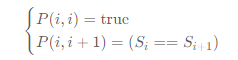

#### 5 最大回文子串

状态方程：
$$
P(i,j)=P(i+1,j−1)∧(Si==Sj)
$$
起始条件：



代码如下：

```java
/**
 * dp[i][j] 表示字符 s[i,j] 是否是回文串：
 * 由于 dp[i][j] 需要 dp[i + 1][j - 1], 因此从后向前，先计算 i == n - 2 的情况
 */
public String longestPalindrome(String s) {
    int n = s.length();
    if (n < 2) return s;
    int start = 0, end = 0;

    boolean[][] dp = new boolean[n][n];
    for (int i = 0; i < n; ++i) {
        dp[i][i] = true;
    }
    for (int i = n - 2; i >= 0; --i) {
        for (int j = i + 1; j < n; ++j) {
            if (s.charAt(i) == s.charAt(j)) {
                dp[i][j] = j == i + 1 || dp[i + 1][j - 1];
                if (dp[i][j] && (end - start) < (j - i)) {
                    start = i;
                    end   = j;
                }
            }
        }
    }
    return s.substring(start, end + 1);
}
```


#### 10 正则表达式

- `'.'` 匹配任意单个字符
- `'*'` 匹配零个或多个前面的那一个元素


#### 32 最长有效括号

> 求格式正确的括号长度

dp[i] 表示 以下标i结尾的最长有效括号的长度；

当前字符：

- '('：dp[i] = 0;
- ')':
  - s[i] = ')' && s[i - 1] == '(' => dp[i] = dp[i - 2] + 2
  - s[i] = ')' && s[i - 1] == ')' 
    - if s[i - 1 - dp[i - 1]] == '('：dp[i] = dp[i - 1] + dp[i - dp[i - 1] - 2] + 2


代码：

```java
public int longestValidParentheses(String s) {
    int maxans = 0;
    int[] dp = new int[s.length()];
    for (int i = 1; i < s.length(); i++) {
        if (s.charAt(i) == ')') {
            if (s.charAt(i - 1) == '(') {
                dp[i] = (i >= 2 ? dp[i - 2] : 0) + 2;
            } else if (i - dp[i - 1] > 0 && s.charAt(i - dp[i - 1] - 1) == '(') {
                dp[i] = dp[i - 1] + ((i - dp[i - 1]) >= 2 ? dp[i - dp[i - 1] - 2] : 0) + 2;
            }
            maxans = Math.max(maxans, dp[i]);
        }
    }
    return maxans;
}
```


#### 42 接雨水

##### 暴力

当前列：

- 最左 || 最右：不存水；
- 左侧最高 L, 右侧最高R：存水 = min(L, R) - current；

##### 动态规划

两个数组：分别保存左侧最高和右侧最高（不含自身）

- left[i] = max(left[i - 1], height[i - 1])：左侧最高 = 上一左侧记录最高和左侧对比，最高者得；
- right 同理；


##### 动态规划-内存压缩

最终求结果时，从左向右遍历，可以记住当前左侧的最高值，无需保存在 left 数组中！


##### 单调栈

经观察发现：当前列只有左右两侧有比自身高的时，才能存水；

栈：存放递减（可以不单调）的元素的索引；

当出现比当前栈顶元素大的元素时，计算存水结果：

```java
class Solution {
    public int trap(int[] height) {
        int ans = 0;
        Deque<Integer> stack = new LinkedList<Integer>();
        int n = height.length;
        for (int i = 0; i < n; ++i) {
            while (!stack.isEmpty() && height[i] > height[stack.peek()]) {
                int top = stack.pop();
                if (stack.isEmpty()) {
                    break;
                }
                int left = stack.peek();
                int currWidth = i - left - 1;
                int currHeight = Math.min(height[left], height[i]) - height[top];
                ans += currWidth * currHeight;
            }
            stack.push(i);
        }
        return ans;
    }
}
```


#### 通配符匹配

- `'?'` 可以匹配任何单个字符。
- `'*'` 可以匹配任意字符序列（包括空字符序列）。

dp\[i][j] 表示字符串 s 的前 i个字符和模式 p 的前 j个字符是否能匹配:

- 若 p_i 是字母，则：dp\[i][j] = (s_i == p_j) && dp\[i - 1][j - 1]
- 若 p_i 是 `?`，则：dp\[i][j] = dp\[i - 1][j - 1]
- 若 p_i 是 `*`,  则：dp\[i][j] = dp\[i - 1][j] || dp\[i]\[j - 1]
  - dp\[i-1][j] 表示匹配当前s_i;
  - dp\[i][j - 1] 表示跳过当前 `*` 字符；


#### 45 跳跃游戏2 （非动态规划）

```cpp
int jump(vector<int>& nums)
{
    int ans = 0;
    int end = 0; 	// 表示上次跳跃的落脚点，起始点表示第 0 次起跳
    int maxPos = 0;
    for (int i = 0; i < nums.size() - 1; i++)
    {
        maxPos = max(nums[i] + i, maxPos);
        if (i == end)
        {
            end = maxPos;
            ans++;
        }
    }
    return ans;
}
```


#### 72 编辑距离

|      | *    | a    | c    |
| ---- | ---- | ---- | ---- |
| *    | 0    | 1    | 2    |
| a    | 1    | 0    | 1    |

- word[i] == word[j]：dp\[i][j] = dp\[i - 1][j - 1]
- !=：dp\[i][j] = min(dp\[i - 1][j - 1], dp\[i - 1][j], dp\[i][j - 1]) + 1

其中：

- dp\[i - 1][j - 1]：表示替换；
- dp\[i - 1][j]：表示删除；
- dp\[i][j - 1])：表示插入；


#### 132 分割回文串2 - 双重动态规划

##### 第一重

计算 g\[i][j] 能否构成回文串。（详情见回文数 131）


##### 第二重

f[i] 表示字符串 s[0,,,i] 的最少分割次数。

f[i] = min {f[j]} + 1; 其中 0 <= j < i


代码如下：

```java
public int minCut(String s) {
    int n = s.length();

    boolean[][] dp = new boolean[n][n];
    for (int i = 0; i < n; ++i) {
        dp[i][i] = true;
    }

    for (int i = n - 2; i >= 0; --i) {
        for (int j = i + 1; j < n; ++j) {
            if (s.charAt(i) == s.charAt(j)) {
                dp[i][j] = j == i + 1 || dp[i + 1][j - 1];
            }
        }
    }

    // 第二重动态规划
    int[] f = new int[n];
    Arrays.fill(f, Integer.MAX_VALUE);
    for (int i = 0; i < n; ++i) {
        if (dp[0][i]) {
            f[i] = 0;
        } else {
            for (int j = 0; j < i; ++j) {
                if (dp[j + 1][i]) {
                    f[i] = Math.min(f[i], f[j] + 1);
                }
            }
        }
    }
    return f[n - 1];
}
```

