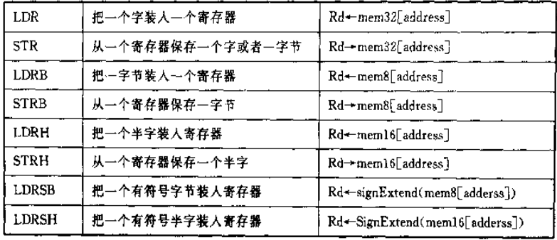
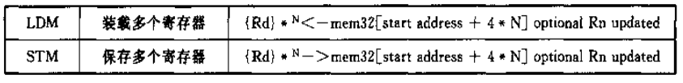
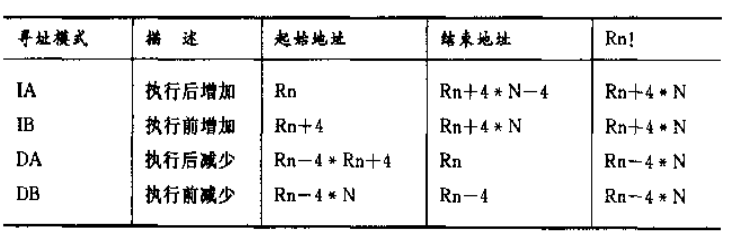
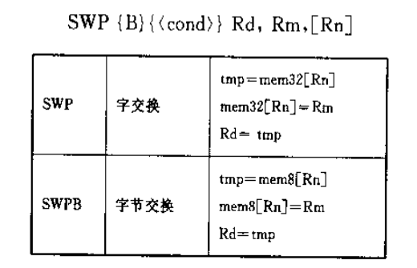
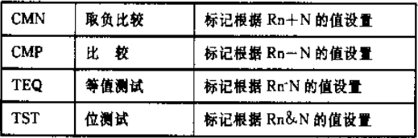
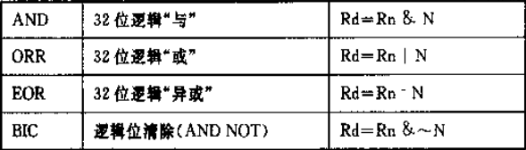
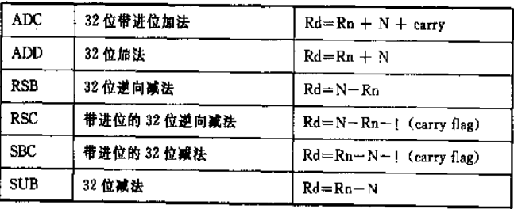
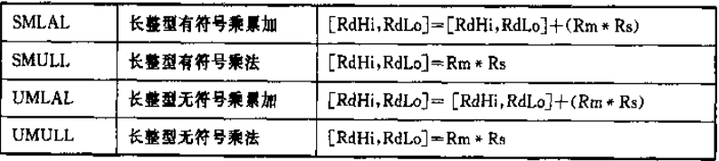
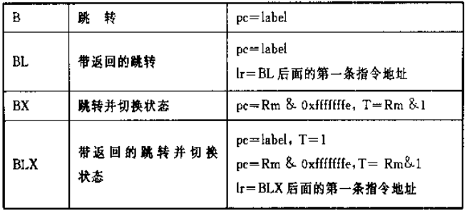

AMBA：高级微控制总线结构；

- ASB：ARM系统总线结构；
- APB：ARM外设总线；

AHB：ARM高性能总线；


##### 状态

- N：有符号数运算，结果为负
- Z：结果为0
- C：无符号数运算溢出
- V：有符号数运算溢出


#### CMP

##### 溢出

两同号数相减 ，值不会溢出！

条件：

- 两正数相加，值为负；
  - 引申：正数 - 负数 = 负数 => 溢出；
- 两负数相加，值为正；
  - 引申：负数 - 正数 = 正数 => 溢出；

引申可解释为：两相异数相减，结果与减数同号，则溢出！

##### 格式

cmp a, b

- Z = 1：两数相等；

- Z = 0

  - 无符号时，查看C
    - C = 1：表示进位或者借位，cmp 执行减操作 -> 借位！因此 a < b
    - C = 0：无进位或借位，则 a > b
  - 有符号时，查看 N 和 V：
    - N = 0，V = 0：表示结果为 正，无溢出 => a > b
    - N = 1，V = 0：表示结果为 负，无溢出 => a < b
    - N = 0，V = 1：表示结果为 正，有溢出 => a 为负数，b 为正数 => a < b
    - N = 1，V = 1：表示结果为 负，有溢出 => a 为正数，b 为负数 => a > b

  

### 指令

#### load-store

##### 单寄存器：



回写型前变址：计算出新的地址后，更新基址寄存器的内容；再利用新的地址进行寻址！

后变址：使用原地址寻址之后，再更新基址寄存器的内容！

常用于遍历数组：

```assembly
PRE
	r0 = 0x00000000
	r1 = 0x00009000
	mem32[0x00009000] = 0x01010101
	mem32[0x00009004] = 0x02020202
	LDR r0, [r1, #4]!   ;回写型前变址, 后添加 !
```


##### 多寄存器：





```assembly
mem32[0x80018] = 0x03
mem32[0x80014] = 0x02
mem32[0x80010] = 0x01
r0 = 0x80010
r1 = 0x00000
r2 = 0x00000
r3 = 0x00000

LDMIA = r0!, {r1-r3}

; 将r0地址指向的内容 -> r1 = 0x01, 同时 r0 += 4；
; 将r0地址指向的内容 -> r2 = 0x02, 同时 r0 += 4;
; ...
; 最终 r0 = 0x8001c
```

实例：

```assembly
; r9 存放源数据起始地址
; r10 存放目标数据起始地址
; r11 存放源数据结束地址
loop
	LDMIA r9!, {r0-r7}
	STMIA r10!, {r0-r7}
	CMP r9, r11
	BNE loop
```


交换指令：



交换指令在执行期间不能被其他任何指令或者任何总线访问打断，直到交换完成！spin

```assembly
spin
	mov r1, =semaphore
	mov r2, #1
	swp r3, r2, [r1]  ;hold the bus until complete
	cmp r3, #1 
	BEQ spin
```

信号量 semaphore 指向的地址单元内容为 0 或者 1：

- 如果信号量 = 1，表示该服务正在被另一个过程执行，即r3的值恒为1，跳转循环；
- 如果为0，则表示该服务被释放；


##### 数据处理

```assembly
mov r7, r5  		; r7 = r5

mov r7, r5, LSL #2 	; let = r7 = r5 * 4 (r5 << 2); r5不会变化

add r0, r1, r1, LSL #1  ; r0 = r1 + r1 * 2
```

比较：



逻辑：



算术：




乘法：



##### 跳转



```assembly
	BL    subroutine   ; 跳转到子程序：此时pc = 子程序地址；lr = BL的下一条指令的地址 
	CMP   r1, #5	   ; r1 和 5 进行比较
	MOVEQ r1, #0	   ; if (r1 == 5) then r1 = 0

subroutine
	MOV pc, lr			; 返回
```


