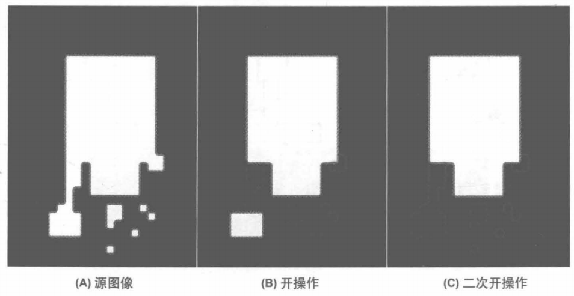
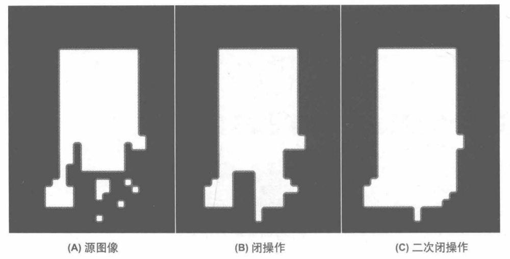

#### 腐蚀与膨胀

##### 膨胀

- 膨胀是一种卷积操作，它将目标像素的值替换为卷积核覆盖区域的局部最大值；

- 通常，膨胀采用的核是一个四边形或圆形的实心核，其锚点在中心；
- 膨胀扩张了明亮区域；
- 膨胀填充凹面；

##### 腐蚀

- 腐蚀操作计算的是核覆盖范围内的局部最小值；
- 腐蚀缩减了明亮区域；
- 腐蚀消除突起；

#### 开闭操作

##### 开 操作

- 先将图像腐蚀，然后对腐蚀的结果膨胀；
- 开操作常用语对值图像中的区域进行计数；

比如：对显微镜载玻片上细胞的图像已经做了阙值化处理，在对区域进行计数之前，需要用开操作来将相互靠得很近的细胞分开。

##### 闭操作

- 闭操作先将图像进行膨胀，然后对膨胀的结果进行腐蚀；
- 常用于复杂连通分支算法中减少无用或噪声驱动的片段；

