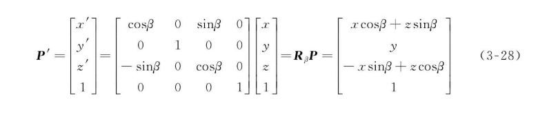
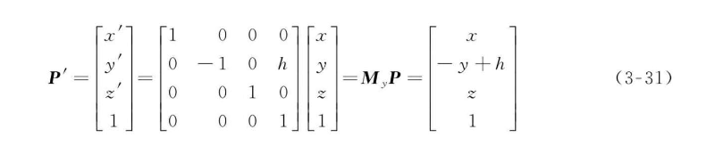

### &#x20;

### 几何变换

#### 平移

#### 放缩

- 尺度放缩：a = b = c
- 拉伸放缩：

#### 旋转

##### 绕z轴

##### 绕y轴

##### 绕x轴

#### 镜像

##### 水平镜像

##### 垂直镜像

#### 剪切

##### 水平剪切

##### 垂直剪切

##### 效果图

#### 透视

变换方式：

其中 ax + by + cz = 0 为透视面。

##### 相关细节

公式1：
$$
\begin{equation}
\left\{
\begin{matrix}
x''=\frac{x'}{z'}=\frac{a_{11}x+a_{12}y+a_{13}}{a_{31}x+a_{32}y+a_{33}} \\
y''=\frac{y'}{z'}=\frac{a_{21}x+a_{22}y+a_{23}}{a_{31}x+a_{32}y+a_{33}}
\end{matrix}
\right.
\end{equation}
$$

$$
\begin{equation}
\begin{bmatrix}
x'' = \frac{k(a_{11}x + a_{12}y + a_{13})}{k(a_{31}x + a_{32}y + a_{33})} = \frac{a_{11}x + a_{12}y + a_{13}}{a_{31}x + a_{32}y + a_{33}} \\
y'' = \frac{k(a_{21}x + a_{22}y + a_{23})}{k(a_{31}x + a_{32}y + a_{33})} = \frac{a_{21}x + a_{22}y + a_{23}}{a_{31}x + a_{32}y + a_{33}}
\end{bmatrix}
\end{equation}
$$

### 仿射变换

仿射变换 = 线性变换 + 平移；直观上来讲，仿射变换特点：

- 经过变换后，点还是点，线还是线，面还是面（如果不是仿射变换而是3D投影的话，在一定的视角下，面有可能变成线，线有可能变成点）
- 经过变换后，平行线和平行面依然平行
- 经过变换后，图形间的某些比例关系保持不变，比如两条平行线的长度比不变，点在线段中的位置比例保持不变

#### 线性变换

缩放、旋转、剪切、镜像都是线性变换；（平移不是）

- 变换前是直线的，变换后依然是直线；
- 直线比例保持不变；
- 变换前是原点的，变换后依然是原点；

