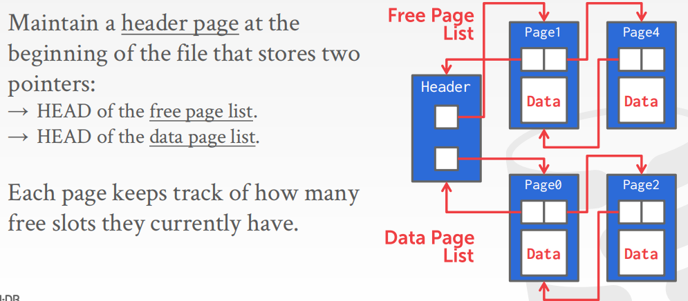
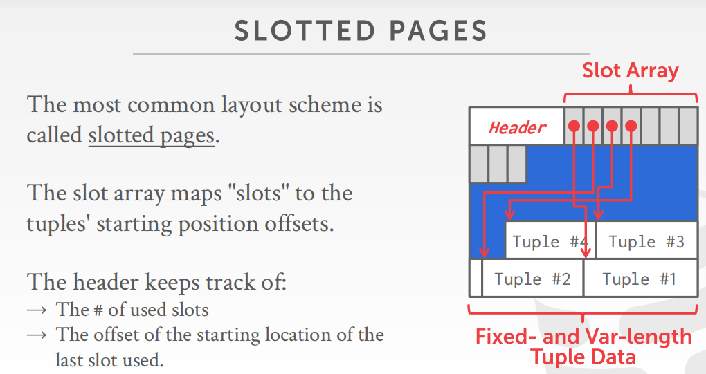

#### 页面池

##### 错误示范-链表

##### 页目录

维持一个专门存储目录的页，目录中维护**页 ID 到具体文件位置的偏移量的映射**：

- key：页面 id；
- value：文件位置偏移hash；

同时维护页的空闲空间信息；

#### 页布局

##### 页头信息

- 页大小
- DBMS版本
- 压缩信息
- 事务信息
- 校验和

##### 错误示范-元组存储

所有元组大小相等：

头部记录元组的数量；同时需要额外记录该元素是否是空闲；

所有元素大小不等：

需要记录每个元组对应的内存起始位置和占用内存大小；会出现内存碎片；

##### slotted-pages （槽页设计）

详细设计为：

- 槽数组记录每个元组在页中的存储偏移；
- 槽数组从前向后写；元组在页内后后向前写；
- 即使是移动、交换元组，只需要更改槽数组记录的元组偏移即可；

#### 元组设计

##### 头涉及内容

- 元组大小；
- 事务信息；
- null位图：哪些列是null；
- 等等；

每个元组都会分配唯一的id，通过这个id可以直接或者间接的获取到该元组所在的页的id和所在页上槽的偏移量等等；

