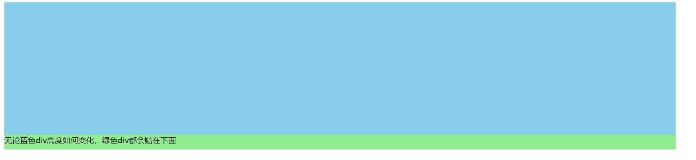

#### 垂直居中

##### line-height： 适合单独一行垂直居中

```css
<div id="d"> 垂直居中内容 </div>
<style>
#d {
	line-height: 100px;
}
</style>
```

##### padding：多行文本

```css
<style>
#d {
    padding: 30 0;
}
div{
    border:solid 1px lightskyblue;
}
</style>
 
<div id="d">多行内容 多行内容 多行内容 多行内容 多行内容 多行内容 多行内容 多行内容 多行内容 多行内容 多行内容 多行内容 多行内容 多行内容 多行内容 多行内容 多行内容 多行内容 多行内容 多行内容 多行内容 多行内容 多行内容 多行内容 多行内容 多行内容 多行内容 多行内容 多行内容 多行内容 多行内容 多行内容 多行内容 多行内容 多行内容 多行内容 多行内容 多行内容 多行内容 多行内容  </div>
```

##### 单元格

```html
<style>
#d {
    display: table-cell;
    vertical-align: middle;
    height: 600px;
}

div {
    border: solid 1px lightblue;
    background-color: lightcoral;
}
</style>
<body>
    <div id="d">
        
    </div>
</body>
```

#### 水平居中

##### 内容居中

```html
<div align="center">
    居中内容
</div>
```

##### 元素居中

- 默认情况下div会占用100%宽度；因此无法观察元素是否居中；

  - 可以先设置 div 宽度；
  - 然后使用margin: 0 auto；使得元素水平居中；（margin 设置外边距，如果只有两个参数，第一个表示上下边距、第二个表示左右边距；0 表示上下边距为0，左右根据宽度自适应（水平居中）；

- span是内联元素，无法设置宽高，不能同 margin: 0 auto; 设置居中

  可以将 span 放置在 div 中，再将div 内容居中

#### 紧贴组件



```html
<style>
#div1
{
    position: relative;
    height: 300px;
    width: 90%;
    background-color: skyblue;
}
#div2
{
    position: absolute;
    bottom: 0;
    height: 30px;
    width: 100%;
    background-color: lightgreen;
}
</style>
<div id="div1">
    <div id="div2"> 无论蓝色div高度如何变化，绿色div都会贴在下面</div>
</div>
```

> 其中起作用的是 子div 组件中的 bottom： 0