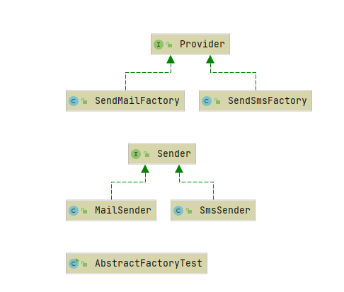

#### 抽象工厂



##### sender

接口：

```java
public interface Sender {
    public void Send();
}
```

实现类：

```java
public class MailSender implements Sender {
    @Override
    public void Send() {
        System.out.println("this is mail sender!");
    }
}

public class SmsSender implements Sender {
    @Override
    public void Send() {
        System.out.println("this is sms sender!");
    }
}
```


##### 抽象工厂类

接口：

```java
public interface Provider {
    public Sender produce();
}
```

工厂实现类：

```java
public class SendMailFactory implements Provider {
    @Override
    public Sender produce(){
        return new MailSender();
    }
}

public class SendSmsFactory implements Provider{
    @Override
    public Sender produce() {
        return new SmsSender();
    }
}
```


##### 测试

```java
public static void main(String[] args) {
    // 根据传入的工厂的不同，创建发送类用以不同方式发送信息
    sendMessage(new SendMailFactory());
    sendMessage(new SendSmsFactory());
}

private static void sendMessage(Provider provider) {
    Sender sender = provider.produce();
    sender.send();
}
```

