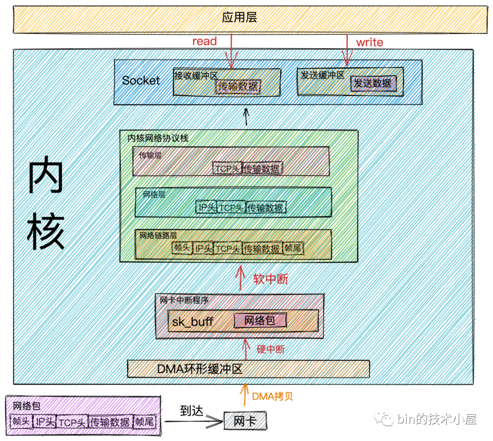

##### 网络包接收流程

简单表述为：

1. 网卡接收网络数据帧时， 通过DMA方式将数据写入 DMA 环形缓冲区；
   - 环形缓冲区：网卡启动时分配和初始化的环形缓冲队列；
   - 超过大小则丢弃；
   - 可通过 ethtool 增大 RingBuffer长度；
2. DMA结束之后，**网卡** 向CPU发送硬中断；
3. CPU收到中断请求时，CPU调用 **网卡**注册的中断响应程序；
4. 硬中断响应程序在内核中创建数据结构 **sk_buffer**，并将 网络数据帧 拷贝到 sk_buffer 中，然后发起软中断请求；
5. 内核中 ksoftirqd 线程 接收软中断请求，并调用 **网卡驱动**注册的poll函数，用以将 sk_buffer中的网络数据帧发送到**内核协议栈**注册的ip_rcv 函数；
6. ip_rcv 获取到 ip 头：如果是发送本机的，则取出传输层协议，去掉IP头，将数据传送给 传输层处理；
7. 如果是tcp协议，则tcp_rcv函数处理：去掉TCP头，得到**（源IP，源端口，目的IP，目的端口）**；然后查找对应端口的socket：
   - 如果找到，则将数据拷贝到对应socket的接收缓冲区；
   - 如果没有，则发送**目标不可达**的icmp包；

