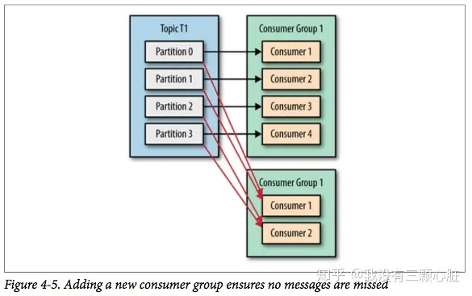

### Kafka

#### 基本组成

1. **Producer（生产者）：** 生产者负责将数据发布到 Kafka 集群。它将数据分割为多个消息，并将这些消息发布到一个或多个主题（Topics）中。生产者可以是单个应用程序或分布式系统。
2. **Consumer（消费者）：** 消费者订阅一个或多个主题，并从 Kafka 集群中拉取数据。消费者消费发布到主题的消息，并进行相应的处理。消费者可以是单个应用程序或分布式系统。
3. **Broker（代理服务器）：** 代理服务器是 Kafka 集群的节点，负责接收和存储发布的消息，并处理来自生产者和消费者的请求。每个代理服务器都是一个独立的 Kafka 服务器，它们组成了整个 Kafka 集群。
4. **Topic（主题）：** 主题是消息的类别或流的名称。消息被发布到特定的主题，并且消费者订阅特定的主题来获取消息。主题可以分区和复制以实现高吞吐量和容错性。
5. **Partition（分区）：** 主题可以分为多个分区，每个分区是一个有序的、不可变的消息序列。分区可以分布在多个代理服务器上，以实现负载均衡和伸缩性。每个分区都有一个唯一的标识符（Partition ID）。
6. **Offset（偏移量）：** 消息在分区中的位置被称为偏移量。消费者可以通过指定偏移量来读取分区中的消息。Kafka 会为每个分区中的每条消息分配一个唯一的偏移量

##### partition和broker有什么关联

在 Kafka 中，当创建一个主题并指定需要的分区数量时，Kafka 会尽量将这些分区均匀地分配给可用的 Broker，以实现负载均衡和高可用性。

如果你创建一个主题并指定需要 4 个分区，而同时有足够的可用 Broker，Kafka 会尽量将这 4 个分区分配给不同的 Broker。这样可以确保每个 Broker 承载的负载相对均衡，并且即使其中一个 Broker 发生故障，主题的分区仍然可以继续在其他 Broker 上提供服务。

- 同一topic下的不同partition，可能分布在不同的broker上，以达到负载均衡、高吞吐量和可伸缩性的目的；

  

##### 分区读写

 生产者发送消息到特定主题的特定分区时，消息首先发送到该分区的领导者副本所在的 Broker。领导者负责接收和写入消息，并将消息复制到追随者副本。消费者从特定分区的领导者副本或可用的追随者副本读取消息。

#### 工作流程

1. **创建主题（Topic）：** 在 Kafka 集群中创建一个主题，指定主题的名称、分区数和复制因子。
2. **生产者发送消息（Producer）：** 生产者将消息发送到一个或多个主题。生产者可以选择将消息发送到特定的分区，也可以让 Kafka 自动选择分区。（同一消息只能发送到一个分区）
3. **消费者订阅主题（Consumer）：** 消费者订阅一个或多个主题，并从 Kafka 集群中拉取消息。
4. **消息存储和分发（Broker）：** **代理服务器**接收到发布的消息后，将其存储在磁盘上，并根据主题的分区规则将消息分发到相应的分区。
5. **消费者拉取消息（Consumer）：** 消费者定期从 Kafka 集群中拉取消息。消费者可以指定要拉取的分区和偏移量。
6. **消息处理和消费（Consumer）：** 消费者获取拉取到的消息，并进行相应的处理，可能是业务逻辑处理或进一步的传递。
7. **偏移量的管理（Consumer）：** 消费者跟踪已经处理的消息的偏移量，并定期将偏移量提交给 Kafka 集群。这样，即使消费者关闭或重新启动，它也可以从上次提交的偏移量继续消费

#### 相关问题

##### 分区与消费者

某主题下有四个分区：

- 一个消费组中一个消费者：消费者会收到四个分区的消息；
- 一个消费组中四个消费者：每个消费者对应一个分区；
- 一个消费组中超过四个消费者：会有消费者空闲；

因此创建主题时可以使用较多的分区，当负载较高时，适当增加消费者。

##### 消息一次写入，支持任意多的应用读取这个消息

如何实现 **只需写入一次消息，可以支持任意多的应用读取这个消息**？

Kafka 提供了消息复制机制，其中一个副本被指定为领导者（leader），负责处理读写请求；其他副本被称为追随者（follower），用于备份和复制数据。默认情况下，每个分区的副本数为1，即只有一个副本作为领导者。但是，你可以增加分区的副本数以支持多个应用消费同一条消息。

假设你有两个应用，A应用的消费者组为"consumer_group_A"，B应用的消费者组为"consumer_group_B"。你可以按照以下步骤进行配置：

1. 创建一个主题（例如，"example_topic"）并设置多个分区（例如，3个分区）。
2. 增加主题的副本数，确保每个分区有足够的副本来支持多个应用消费。可以使用 Kafka 命令行工具或管理API进行副本数的设置。
3. 将应用A的消费者组"consumer_group_A"中的消费者分配到主题的所有分区上。这样，消费者组A中的消费者将独立地消费所有分区中的消息。
4. 将应用B的消费者组"consumer_group_B"中的消费者也分配到主题的所有分区上。这样，消费者组B中的消费者也可以独立地消费所有分区中的消息。

通过这样的配置，同一条消息将会被复制到多个分区的不同副本中，并由不同的消费者组中的消费者独立地消费。这样就可以实现同一消息既被应用A的消费者组消费，又能被应用B的消费者组消费。

> 在 Kafka 中，副本的管理是由 Kafka 自身自动处理的，而不需要应用程序手动设置副本地址。
>
> 当你创建一个主题并设置多个分区时，Kafka 会自动为每个分区创建副本，并将其分配到可用的 Kafka 代理上。Kafka 使用一种称为副本分配策略（Replica Assignment Strategy）的算法来决定将副本分配给哪些代理。副本分配策略可以根据可用的代理数量、数据的均衡性和可靠性等因素进行调整。
>
> 副本的分配和管理是透明的，应用程序不需要直接干预或设置副本地址。Kafka 会负责将消息复制到副本中，并确保分区的领导者和追随者之间的数据一致性。
>
> 应用程序只需要配置好消费者组和订阅关系，然后使用消费者来消费消息即可。Kafka 会自动将消息从副本中传递给消费者，无需应用程序关心副本的具体位置或管理

**假如应用A从分区中读取一个消息，记录偏移；应用B同样读取该消息，需要到分区的副本中读取，请问应用B如何知道副本的位置?**

当应用程序消费消息时，它与 Kafka 代理进行交互，而不是直接与特定副本进行通信。应用程序使用 Kafka 消费者客户端库来订阅主题和分区，并从 Kafka 代理接收消息。

Kafka 代理负责管理消息的分发和副本同步。当应用程序消费消息时，Kafka 代理会将消息从适当的分区副本复制到消费者所连接的代理上，并将消息传递给应用程序。应用程序无需关心副本的具体位置，因为 Kafka 代理会负责处理副本间的数据同步和传输。

Kafka 代理通过维护每个分区的消费者组的消费偏移量（offset）来跟踪哪个副本的消息已被消费，哪个副本上的消息尚未被消费。

每个消费者组在 Kafka 中都有一个唯一的消费者组ID，并且每个消费者都会提供所属消费者组的ID。当消费者从分区中读取消息时，它会提交消费偏移量给 Kafka 代理，表示它已经成功消费到了该偏移量之前的消息。

Kafka 代理会将消费者组的消费偏移量存储在内部的偏移量管理系统中（例如，Kafka 的内置主题 "__consumer_offsets"）。这样，代理就能够跟踪每个分区中每个消费者组的消费偏移量。

当其他消费者加入同一个消费者组并尝试消费同一分区的消息时，Kafka 代理会根据消费者组的消费偏移量，确保每个消费者都能从正确的位置开始消费。代理会根据消费者提交的偏移量信息，决定向消费者发送哪些消息。
