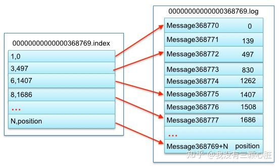

#### segment

在 Kafka 的文件存储中，同一个 Topic 下有多个不同的 Partition，每个 Partition 都为一个目录，而每一个目录又被平均分配成多个大小相等的 **Segment File** 中，Segment File 又由 index file 和 data file 组成，他们总是成对出现，后缀 ".index" 和 ".log" 分表表示 Segment 索引文件和数据文件。

其中以索引文件中元数据 `<3, 497>` 为例，依次在数据文件中表示第 3 个 message（在全局 Partition 表示第 368769 + 3 = 368772 个 message）以及该消息的物理偏移地址为 497。

#### 队列中的消息

队列中的消息会有三个属性：

- offset：表示 message 在当前 Partition 中的偏移量，是一个逻辑上的值，唯一确定了 Partition 中的一条 message，可以简单的认为是一个 id；
- MessageSize：表示 message 内容 data 的大小；
- data：message 的具体内容