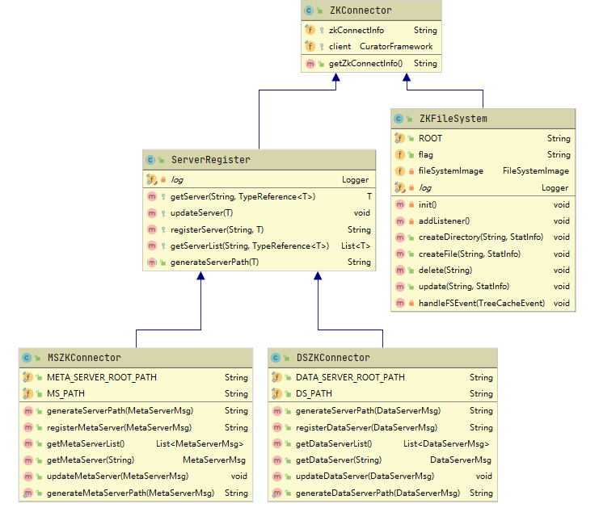
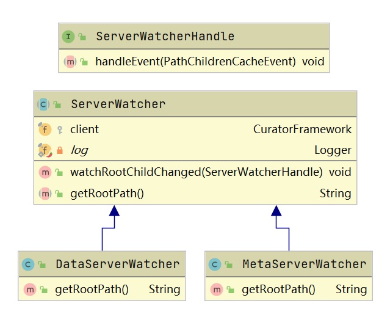
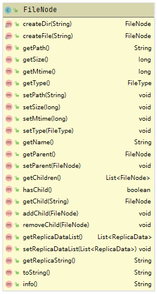

## 分布式文件系统

#### 工作流程

##### 概述

主要分为4个模块：

1. zookeeperModule：对 zookeeper 操作进⾏封装；
2. metaServer：完成文件和文件夹的元数据操作；
3. dataServer：完成文件内容的持久化与读取；
4. client：调⽤以上接⼝；

⼤致过程如下：

1. DataServer 将信息注册到 zookeeper 中，并添加对zookeeper 中 DataServer 根节点的监听，⽤于捕获DataServer 注册与断开；

2. MetaServer 将信息注册到 zookeeper 中，并添加对 zookeeper 中 MetaServer 根节点的监听，⽤于捕获MetaServer 注册与断开；

3. 获取 zookeeper 中所有注册的 DataServer 和 MetaServer 列表；
4. ZKFileSystem 在 zookeeper 中创建⽤于保存元数据信息的根节点，MetaServer 添加对此根节点的监听，⽤于同步 MetaServer 的元数据变更；


##### **1. DataServer**

DataServer 通过 DSZKConnector 连接上ZooKeeper，并通过 String registerDataServer(DataServerMsg msg) ⽅法将本⾝ DataServerMsg 信息注册到 Zookeeper；

**细节：**

1. ⾸先在zookeeper创建属于 DataServer 的根节点 /zk-ds;
2. 然后根据 DataServer 的ip和端⼝号⽣成唯⼀id，形如 /dsxxxx;
3. 最后在根节点 /zk-ds ⽬录下创建临时节点 /zk-ds/dsxxx，节点的值保存为json 格式的DataServerMsg;


##### 2. MetaServer

1. MetaServer 通过 MSZKConnector 连接上 Zookeeper，并通过 StringregisterMetaServer(MetaServerMsg msg) ⽅法将本⾝的 MetaServerMsg 信息注册到 Zookeeper；

2. MetaServer 通过 MSZKConnector中的List<MetaServerMsg> getMetaServerList() 获取到所有注册到 Zookeeper 上的 MetaServer 信息；

3. MetaServer 通过 DSZKConnector 中的 String registerDataServer(DataServerMsg msg) 获取所有注册到 Zookeeper 上的 DataServer 信息；

**细节：**

1. ⾸先在 zookeeper 创建属于 MetaServer 的根节点 /zk-ms;
2. 然后根据 MetaServer 的ip和端⼝号⽣成唯⼀id，形如 /msxxxx;

3. 最后在根节点 /zk-ms ⽬录下创建临时节点 /zk-ms/msxxx，节点的值保存为json 格式的MetaServerMsg;


##### 3. ZKFileSystem

ZKFileSystem ⽤于保存创建的文件和文件夹的元数据信息，启动时：

1. 在 zookeeper 创建属于 ZKFileSystem 的根节点 /zk-fs;
2.  添加对这个根节点 /zk-fs 的监听；

> 比如当 SDK 在 ms1(MetaServer1)创建文件夹时, ms1 除了本地内存保存基本的文件结构外（下⾯会说），会通过 ZKFileSystem 在 zookeeper 中创建相应的结构；监听 /zk-fs 的所有MetaServer 都会接收到节点的变化（add，update，delete等等），然后可以通过监听事件在本机内存同步


### 实现

#### **zookeeper** **相关模块**

##### **⼯具类** **zookeeperUtil**： 封装对 zookeeper 的基本操作



##### **zookeeper** **信息注册与获取**

- ZKConnctor：持有 CuratorFramework, 维持与 zookeeper 的连接；

- ServerRegister：
  - 将服务器（MetaServer、DataServer）注册到 zookeeper；
  - 更新 zookeeper 中保存的服务器的信息（比如 DataServer 中创建文件时，更改可⽤空间的信息）；
  - 获取所有在 zookeeper 注册的服务器的列表信息；

- ZKFileSystem:
  - 在 zookeeper 中创建关于元数据的信息节点，并监听相关变化；
  - 在监听处理中 FileSystemImage 同步其他 MetaServer到本地内容；

- DSZKConnector：⽤于处理具体的 DataServer 事务；
- MSZKConnector：⽤于处理具体的 MetaServer 事务；

##### zookeeper 节点监听

Client 中监听 zookeeper 中 DataServer 的根节点 /zk-ds 和 MetaServer 的根节点 /zk-ms，⽤于获取最新的DataServer 列表和 MetaServer 列表；同样，MetaServer 中也有类似的使⽤。UML 如下：



例子：

```java
// 定义 FunctionalInterface 类型的函数
@FunctionalInterface
public interface ServerWatcherHandle {
 void handleEvent(PathChildrenCacheEvent event);
}
// 创建核⼼处理函数
ServerWatcherHandle dsWatcherHandler = event -> {
 if (event != null && event.getData() != null) {
 LOGGER.info("DS 事件: 类型 = {}, path = {}, data = {}", event.getType(),
             event.getData().getPath(), new String(event.getData().getData()));
 PathChildrenCacheEvent.Type type = event.getType();
 if (type.equals(PathChildrenCacheEvent.Type.CHILD_ADDED)
 || type.equals(PathChildrenCacheEvent.Type.CHILD_REMOVED)
 || type.equals(PathChildrenCacheEvent.Type.CHILD_UPDATED)) {
 // 出现增加、删除、修改节点时, 更新可⽤列表
 updateDataServerList();
 }
 }
};
// 注册监听
try {
    // 注册 DataServer 变化监听
 new DataServerWatcher(zookeeperAddr).watchRootChildChanged(dsWatcherHandler);
} catch (Exception e) {
 LOGGER.error("添加 DataServer 监听失败: {}", e.getMessage(), e);
}
```


#### **MetaServer** **相关模块**

##### 概述

MetaServer 处理 client 的文件请求：

1. create: 根据路径创建文件；
   - ⾸先获取指定路径的文件，如果存在，将结果FileNode转换为 StatInfo 并回复给 client;
   - 如果不存在，则调⽤ MetaService 中的 createFile创建：
     1. 通过负载均衡尝试写入不同的 DataServer副本，并将创建成功的 DataServer 信息记录在ReplicaData 中；
     2. 通过 FileSystemImage 在 MetaServer 本地内存创建文件的元数据信息；
     3. 通过 ZKFileSystem 在 zookeeper 中创建文件的元数据信息，⽤于在所有的 MetaServer 中同步；
     4. 然后在返回的是创建成功的 DataServer 的列表，最终以 StatInfo 形式返回；

2. mkdir：
   - 通过调⽤ FileSystemImage 在 MetaServer 内存中创建文件夹的元数据信息；
   - 通过调⽤ ZKFileSystem 在 zookeeper 中创建文件夹的元数据信息；
   - ⽆需在 DataServer 中创建；

其余操作具体可参⻅ MetaService。


##### **FileSystemImage** **文件镜像**

⽤于记录在 MetaServer 中创建的文件夹与文件的元数据，当创建、获取或者删除文件以及文件夹时能够快速定位到文件信息。

核⼼类 FileNode, 与 StatInfo 很相似，但是多了以下属性:

```java
// ⽤于表⽰该文件夹(文件的话，此属性为 null)下的其他文件元数据
private List<FileNode> children; 
// ⽤于表⽰该文件(文件夹)的⽗FileNode
// ⽤于删除节点时快速获取⽗节点，并从⽗节点的 children 中删除
private FileNode parent;
```

相关操作如下：



比如创建 "/dir1", "/dir1/dir2", "/dir1/test.txt"文件夹，FileSystemImage 保存内存输出为(输出格式具体可⻅ logFileSystemInfo ⽅法):

> |/ - Directory - 0B - 1693111790504 - []
>
> |----dir1 - Directory - 0B - 1693111910824 - [[]]
>
> |--------dir1/test.txt - File - 0B - 1693111910825 - [[localhost:8500,localhost:8501]]
>
> |--------dir1/dir2 - Directory - 0B - 1693111912721 - [[]]


##### ZKFileSystem: zookeeper中的文件系统

除了上文提到了与 zookeeper 交互外，还通过 zookeeper 中/zk-fs的节点信息。

与 FileSystemImage 中的树状结构不同，它只是维护⼀个⼀层文件⽬录。以创建/dir/test.txt 为例：

- FileSystemImage中会为 /dir 创建⼀个 FileNode 类型的文件节点，然后在 FileNode 节点下创建test.txt的 FileNode 节点(path 依旧记为 /dir/text.txt 便于搜索);

- ZKFileSystem 则是根据 /dir 的 hashCode + fileName (text.txt)⽣成唯⼀的文件名，并在 /zk-fs 根节点下创建；（详情参⻅ FileSystemImage中的 getFormatPath 函数);

在 MetaServer 中的 MetaService 处理复杂的操作，以创建文件(createFile) 为例:

1. ⾸先矫正文件路径（传入的路径可能不是以 / 开头或者 windows 的\\⻛格；具体调⽤FileSystemImage 中的 rectifyPath ⽅法）；

2. 通过 FileSystemImage 在内存中创建对应的文件（可能递归创建文件夹);
3. 然后根据矫正后的路径，调⽤ getFormatPath ⽣成唯⼀的路径，⽤于存储在 zookeeper，避免创建树状结构导致的复杂操作；

4. 通过负载均衡算法，获取合适的 DataServer, 并调⽤ DataServer 中创建文件的接⼝，获取返回结果（详情参⻅ MetaService中的 getWritableReplicaDataList ⽅法);

5. 为 FileSystemImage 中创建的 FileNode 设置 DataServer 接⼝返回的结果，即List<ReplicaData>;

同样以上述创建的文件夹为例，zookeeper 中保存的元数据内容为:

> [zk: localhost:2181(CONNECTED) 1] ls /zk-fs
>
> [dir1]
>
> [zk: localhost:2181(CONNECTED) 2] ls /zk-fs/dir1
>
> [dir2, test.txt]
>
> [zk: localhost:2181(CONNECTED) 3] get /zk-fs/dir1/test.txt
>
> {"path":"dir1/test.txt","size":0,"mtime":1693111910825,"type":"File",
>
> "replicaData":
>
> [{"id":"/zk-ds/ds1311895490","dsNode":"localhost:8500","path":"D:\\homework\\minfs_student\\bin\\zk-ds\\ds1311895490\\1461081983-test.txt"},
>
> {"id":"/zk-ds/ds1311895491","dsNode":"localhost:8501","path":"D:\\homework\\minfs_student\\bin\\zk-ds\\ds1311895491\\1461081983-test.txt"}]}


##### DataServerManager: DataServer 读写负载均衡

```java
// 上次写入的 data-server 副本
private final Set<DataServerMsg> lastWriteServerSet; 
// 所有可⽤的 data-server 
private final Map<String, DataServerMsg> availDataServerMap;
```

**读均衡思想：**

- availDataServerList 按照访问先后顺序排列，排列在后⾯的是最近访问的，前⾯则是相对很久前才访问

的，

- [a, d, c, b] 为例：当文件的副本信息存在名为 b,c,d 的DataServer副本上时，从前向后遍历可⽤列表：
  1. a：没有在可⽤副本中，下⼀个；
  2. d：在可⽤副本中，选中，并将 d 放到列表最后，即 [a,c,b,d], 并返回d；（表⽰ d 当前选中，失去下次优先选中的机会）

- 当再次获取副本时，则从 [a,c,b,d] 中获取，同上，则获取的是 c 最终只需要返回⼀个 ReplicaData 即可，其中 dsNode 属性记录着⽬标 DataServer的ip和port组合。详情请⻅ DataServerManager 的getNextReadableList


**写均衡思想：**当需要获取 count 个 DataServer 副本时：

1. 选择上⼀次没有选中的：pick1 = all_avail_set - last_write;
2. 如果 pick1 >= count: 从 pick1 中按照 容量利⽤率 从⼩到⼤排序， 选择前 count 个结果；

3. 如果 pick1 < count: 从 last_write 按照 容量利⽤率 从⼩到⼤排序，选择前 count - pick1.size() 个结果 =>pick2，最终 pick1 + pick2

最终返回的是List<DataServerMsg>, 详情请⻅ DataServerManager 中的 getNextWritableList。该⽅法同时涉及到 超时重试 的功能


#### **DataServer** **相关操作**

除了完成必要的 DataServer 信息在 zookeeper 上的注册，主要完成另外两个功能：

1. write:
   - 通过 RandomAccessFile 完成对文件指定偏移出的数据写入；
   - 通过 DSZKConnector 更正 DataServer 信息(因为写入文件时，文件⼤⼩以及修改时间已经变更，需要重新序列化本 DataServer 的 DataServerMsg信息，然后在 zookeeper 中更新)；

2. read: 相对简单，通过 RandomAccessFile 从指定偏移处读取⼀定的数据；


#### client

##### **MetaServerConnector**

- createFileToMetaServer：调⽤ MetaServer 的接⼝，由其在内存中创建元数据信息，⾄于如何在DataServer 中持久化文件，交由 MetaServer 处理；

- mkdir：调⽤ MetaServer 处理； 其他接⼝具体参⻅ MetaServerConnector。


##### DataServerConnector

当需要从 DataServer 读取相关文件的内容时

1. ⾸先访问 MetaServer，获取该文件的 StatInfo 信息，从⽽获取 List<ReplicaData> replicaData;
2. 然后从 ReplicaData 中获取 DataServer 信息；
3. 最后调⽤ DataServer 中读取文件的接⼝⽤于读取数据；

##### CircleDataBuffer:读写缓冲区

使⽤ byte[]实现循环队列。

当读取文件时，在没有缓冲区的情况下，每读取部分字节，则需要依次调⽤：

1. MetaServer 的 open 接⼝⽤以获取DataServer副本信息；
2. DataServer 需要启动本地文件系统，创建 RandomAccessFile 来从指定文件偏移下读取文件数据；读取 64B 的数据时，每次读取4个字节，则需要重复上述过程 16 次。写过程依旧如此，因此引入读写缓冲区。


以读取文件为例，具体参⻅ FSInputStream中的 read 函数：

1. 当缓冲区为空时，⾸先读取⼀定数量的字节(默认为 1024)，存放的缓冲区中；
2. 当需要读取的数据⼩于缓冲区数据量时，则直接从缓冲区读取即可；
3. 缓冲区数据不⾜时，⾸先将缓冲区中所有数据保存在结果 byte[]中，然后循环从 DataServer 中不断获取数据，直到文件结束或者填满结果 byte[];


#### 启动

由于其余三个模块都依赖 zookeeperModule, 因此需要⾸先编译安装该模块:

> mvn clean install # 在 zookeeperModule 的 pom.xml ⽬录下


然后：

> \# 启动两个 meta-server
>
> java -jar meta-server.jar --server.port=8100
>
> java -jar meta-server.jar --server.port=8101
>
> \# 同理启动 data-server
>
> java -jar data-server.jar --server.port=8500


测试：

> 最终测试代码在 easyClient 中的test中；
>
> 可以通过 metaServer 中test中的 FileSystemImageTest 的 cleanZK 来清理 zookeeper 中注册信息