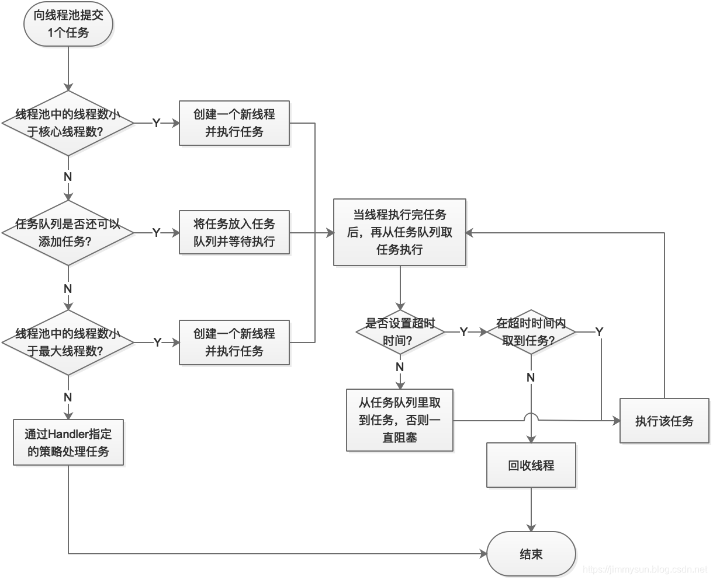
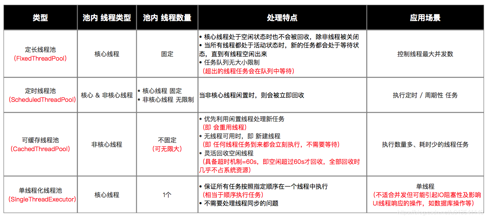

### 线程池

#### 构造函数

```java
public ThreadPoolExecutor(int corePoolSize,
                          int maximumPoolSize,
                          long keepAliveTime,
                          TimeUnit unit,
                          BlockingQueue<Runnable> workQueue) {
    this(corePoolSize, maximumPoolSize, keepAliveTime, unit, workQueue,
         Executors.defaultThreadFactory(), defaultHandler);
}
 
public ThreadPoolExecutor(int corePoolSize,
                          int maximumPoolSize,
                          long keepAliveTime,
                          TimeUnit unit,
                          BlockingQueue<Runnable> workQueue,
                          ThreadFactory threadFactory) {
    this(corePoolSize, maximumPoolSize, keepAliveTime, unit, workQueue,
         threadFactory, defaultHandler);
}
 
public ThreadPoolExecutor(int corePoolSize,
                          int maximumPoolSize,
                          long keepAliveTime,
                          TimeUnit unit,
                          BlockingQueue<Runnable> workQueue,
                          RejectedExecutionHandler handler) {
    this(corePoolSize, maximumPoolSize, keepAliveTime, unit, workQueue,
         Executors.defaultThreadFactory(), handler);
}
 
public ThreadPoolExecutor(int corePoolSize,
                          int maximumPoolSize,
                          long keepAliveTime,
                          TimeUnit unit,
                          BlockingQueue<Runnable> workQueue,
                          ThreadFactory threadFactory,
                          RejectedExecutionHandler handler) {
    if (corePoolSize < 0 ||
        maximumPoolSize <= 0 ||
        maximumPoolSize < corePoolSize ||
        keepAliveTime < 0)
        throw new IllegalArgumentException();
    if (workQueue == null || threadFactory == null || handler == null)
        throw new NullPointerException();
    this.corePoolSize = corePoolSize;
    this.maximumPoolSize = maximumPoolSize;
    this.workQueue = workQueue;
    this.keepAliveTime = unit.toNanos(keepAliveTime);
    this.threadFactory = threadFactory;
    this.handler = handler;
}
```

- corePoolSize（必需）：核心线程数。默认情况下，核心线程会一直存活，但是当将 allowCoreThreadTimeout 设置为 true 时，核心线程也会超时回收。
- maximumPoolSize（必需）：线程池所能容纳的最大线程数。当活跃线程数达到该数值后，后续的新任务将会阻塞。
- keepAliveTime（必需）：线程闲置超时时长。如果超过该时长，非核心线程就会被回收。如果将 allowCoreThreadTimeout 设置为 true 时，核心线程也会超时回收。
- unit（必需）：指定 keepAliveTime 参数的时间单位。常用的有：TimeUnit.MILLISECONDS（毫秒）、TimeUnit.SECONDS（秒）、TimeUnit.MINUTES（分）。
- workQueue（必需）：任务队列。通过线程池的 execute() 方法提交的 Runnable 对象将存储在该参数中。其采用阻塞队列实现。
- threadFactory（可选）：线程工厂。用于指定为线程池创建新线程的方式。
- handler（可选）：拒绝策略。当达到最大线程数时需要执行的饱和策略


#### 运行过程



#### 任务队列

实现 BlockingQueue接口：

- ArrayBlockingQueue：一个由数组结构组成的有界阻塞队列（数组结构可配合指针实现一个环形队列）。
- LinkedBlockingQueue： 一个由链表结构组成的有界阻塞队列，在未指明容量时，容量默认为 Integer.MAX_VALUE。
- PriorityBlockingQueue： 一个支持优先级排序的无界阻塞队列，对元素没有要求，可以实现 Comparable 接口也可以提供Comparator 来对队列中的元素进行比较。跟时间没有任何关系，仅仅是按照优先级取任务。
- DelayQueue：类似于PriorityBlockingQueue，是二叉堆实现的无界优先级阻塞队列。要求元素都实现 Delayed 接口，通过执行时延从队列中提取任务，时间没到任务取不出来。
- SynchronousQueue： 一个不存储元素的阻塞队列，消费者线程调用 take() 方法的时候就会发生阻塞，直到有一个生产者线程生产了一个元素，消费者线程就可以拿到这个元素并返回；生产者线程调用 put() 方法的时候也会发生阻塞，直到有一个消费者线程消费了一个元素，生产者才会返回。
- LinkedBlockingDeque： 使用双向队列实现的有界双端阻塞队列。双端意味着可以像普通队列一样 FIFO（先进先出），也可以像栈一样 FILO（先进后出）。
- LinkedTransferQueue： 它是ConcurrentLinkedQueue、LinkedBlockingQueue 和 SynchronousQueue 的结合体，但是把它用在 ThreadPoolExecutor 中，和 LinkedBlockingQueue 行为一致，但是是无界的阻塞队列

#### ThreadFactory

实现 ThreadFactory 接口中的 newThread(Runnable r)，默认实现：

```java
/**
 * The default thread factory.
 */
private static class DefaultThreadFactory implements ThreadFactory {
    private static final AtomicInteger poolNumber = new AtomicInteger(1);
    private final ThreadGroup group;
    private final AtomicInteger threadNumber = new AtomicInteger(1);
    private final String namePrefix;
 
    DefaultThreadFactory() {
        SecurityManager s = System.getSecurityManager();
        group = (s != null) ? s.getThreadGroup() :
                              Thread.currentThread().getThreadGroup();
        namePrefix = "pool-" +
                      poolNumber.getAndIncrement() +
                     "-thread-";
    }
 
    public Thread newThread(Runnable r) {
        Thread t = new Thread(group, r,
                              namePrefix + threadNumber.getAndIncrement(),
                              0);
        if (t.isDaemon())
            t.setDaemon(false);
        if (t.getPriority() != Thread.NORM_PRIORITY)
            t.setPriority(Thread.NORM_PRIORITY);
        return t;
    }
}
```

##### ThreadGroup

`ThreadGroup`是Java中的一个类，用于对线程进行分组管理。它可以将多个线程组织在一起，并对它们进行统一的控制和管理。`ThreadGroup`主要用途包括以下几个方面：

1. 组织线程：
   - `ThreadGroup`可以用于将相关联的线程进行分组，方便对它们进行统一管理。
   - 通过线程组，可以将一组线程看作一个单元，进行批量的操作，如批量设置线程优先级、中断线程等。
2. 设置线程组属性：
   - `ThreadGroup`对象具有一些属性，如名称、父线程组、是否为守护线程等。
   - 可以通过设置线程组属性，来影响该线程组中所有线程的行为。
3. 处理未捕获异常：
   - `ThreadGroup`可以用于处理线程组中线程抛出的未捕获异常。
   - 可以通过重写`ThreadGroup`的`uncaughtException()`方法，定义自定义的异常处理逻辑。
4. 监控线程组：
   - `ThreadGroup`提供了一些方法来获取线程组的相关信息，如活动线程数、线程组名称等。
   - 这些信息可以用于监控和统计线程组的状态和性能。


#### handler - 拒绝策略

拒绝策略需要实现 **RejectedExecutionHandler** 接口，并实现 **rejectedExecution(Runnable r, ThreadPoolExecutor executor)** 方法。

- AbortPolicy（默认）：丢弃任务并抛出 RejectedExecutionException 异常。
- CallerRunsPolicy：由调用线程处理该任务。
- DiscardPolicy：丢弃任务，但是不抛出异常。可以配合这种模式进行自定义的处理方式。
- DiscardOldestPolicy：丢弃队列最早的未处理任务，然后重新尝试执行任务。


#### 现有线程池

##### 定长线程池 - FixedThreadPool

```java
public static ExecutorService newFixedThreadPool(int nThreads) {
    return new ThreadPoolExecutor(nThreads, nThreads,
                                  0L, TimeUnit.MILLISECONDS,
                                  new LinkedBlockingQueue<Runnable>());
}
public static ExecutorService newFixedThreadPool(int nThreads, ThreadFactory threadFactory) {
    return new ThreadPoolExecutor(nThreads, nThreads,
                                  0L, TimeUnit.MILLISECONDS,
                                  new LinkedBlockingQueue<Runnable>(),
                                  threadFactory);
}
// exam
// 1. 创建定长线程池对象 & 设置线程池线程数量固定为3
ExecutorService fixedThreadPool = Executors.newFixedThreadPool(3);
// 2. 创建好Runnable类线程对象 & 需执行的任务
Runnable task =new Runnable(){
  public void run() {
     System.out.println("执行任务啦");
  }
};
// 3. 向线程池提交任务
fixedThreadPool.execute(task);
```

- **特点**：只有核心线程，线程数量固定，执行完立即回收，任务队列为链表结构的有界队列。
- **应用场景**：控制线程最大并发数


##### 定时线程池 - ScheduledThreadPool 

```java
private static final long DEFAULT_KEEPALIVE_MILLIS = 10L;
 
public static ScheduledExecutorService newScheduledThreadPool(int corePoolSize) {
    return new ScheduledThreadPoolExecutor(corePoolSize);
}
public ScheduledThreadPoolExecutor(int corePoolSize) {
    super(corePoolSize, Integer.MAX_VALUE,
          DEFAULT_KEEPALIVE_MILLIS, MILLISECONDS,
          new DelayedWorkQueue());
}
 
public static ScheduledExecutorService newScheduledThreadPool(
        int corePoolSize, ThreadFactory threadFactory) {
    return new ScheduledThreadPoolExecutor(corePoolSize, threadFactory);
}
public ScheduledThreadPoolExecutor(int corePoolSize,
                                   ThreadFactory threadFactory) {
    super(corePoolSize, Integer.MAX_VALUE,
          DEFAULT_KEEPALIVE_MILLIS, MILLISECONDS,
          new DelayedWorkQueue(), threadFactory);
}

// exam
// 1. 创建 定时线程池对象 & 设置线程池线程数量固定为5
ScheduledExecutorService scheduledThreadPool = Executors.newScheduledThreadPool(5);
// 2. 创建好Runnable类线程对象 & 需执行的任务
Runnable task =new Runnable(){
  public void run() {
     System.out.println("执行任务啦");
  }
};
// 3. 向线程池提交任务
scheduledThreadPool.schedule(task, 1, TimeUnit.SECONDS); // 延迟1s后执行任务
scheduledThreadPool.scheduleAtFixedRate(task,10,1000,TimeUnit.MILLISECONDS);// 延迟10ms后、每隔1000ms执行任务
```

- **特点**：核心线程数量固定，非核心线程数量无限，执行完闲置 10ms 后回收，任务队列为**延时阻塞队列**。
- **应用场景**：执行定时或周期性的任务

##### 可缓存线程池 - CachedThreadPool

```java
public static ExecutorService newCachedThreadPool() {
    return new ThreadPoolExecutor(0, Integer.MAX_VALUE,
                                  60L, TimeUnit.SECONDS,
                                  new SynchronousQueue<Runnable>());
}
public static ExecutorService newCachedThreadPool(ThreadFactory threadFactory) {
    return new ThreadPoolExecutor(0, Integer.MAX_VALUE,
                                  60L, TimeUnit.SECONDS,
                                  new SynchronousQueue<Runnable>(),
                                  threadFactory);
}
```

- **特点**：无核心线程，非核心线程数量无限，执行完闲置 60s 后回收，任务队列为不存储元素的阻塞队列。
- **应用场景**：执行大量、耗时少的任务


##### 单线程 - SingleThreadExecutor

```java
public static ExecutorService newSingleThreadExecutor() {
    return new FinalizableDelegatedExecutorService
        (new ThreadPoolExecutor(1, 1,
                                0L, TimeUnit.MILLISECONDS,
                                new LinkedBlockingQueue<Runnable>()));
}
public static ExecutorService newSingleThreadExecutor(ThreadFactory threadFactory) {
    return new FinalizableDelegatedExecutorService
        (new ThreadPoolExecutor(1, 1,
                                0L, TimeUnit.MILLISECONDS,
                                new LinkedBlockingQueue<Runnable>(),
                                threadFactory));
}
```

- **特点**：只有 1 个核心线程，无非核心线程，执行完立即回收，任务队列为链表结构的有界队列。
- **应用场景**：不适合并发但可能引起 IO 阻塞性及影响 UI 线程响应的操作，如数据库操作、文件操作等


#### 总结

