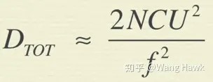

#### 景深

在一定的像距情况下，要想让一个物体清晰成像，它必须位于一定的范围内，这个范围我们就称之为景深。

- 景深是和光圈值大小成线性关系的，光圈值越小，景深越小；
- 与物距成二次方关系，所以物距越远，景深越大；
- 和焦距的平方成反比，所以焦距越大，景深越浅。长焦镜头看到的图像背景更加的模糊。

#### 对焦与变焦

对焦是在焦距不变的情况下，改变像距，此时镜头与传感器之间的距离发生改变，因此也就需要调整物距才能拍摄清晰的像。所以你拿着一个定焦镜头相机，需要拍摄时要调整自己的位置来取景，拍摄出想要的画面。

变焦则可以在不改变物距的情况下，调整放大倍率。你要拍摄远处的美女，不用凑上去拍，只要调整焦距就可以了。

这是因为变焦镜头需要更复杂的镜头组合，这样会产生更多的画面的质量缺陷（之前介绍的色差、球差等等），因此其画面质量通常没有定焦镜头好。

#### 曝光

##### 快门

用于控制入射光照射到传感器上的时间：

- 快门速度不够快时，拍摄的图像会模糊、拖尾，这种模糊我们称之为“运动模糊”；

##### 光圈

用于控制镜头的通光面积：