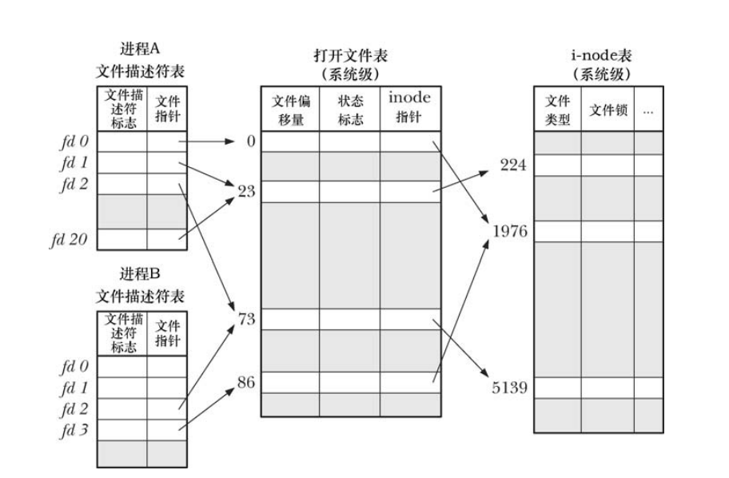

#### 文件描述符

进程A中：fd1 和 fd20 指向同一个打开的文件句柄；（dup()，fcntl（））

进程A中的 fd2 和 进程B中的fd2 同样指向同一个打开的文件句柄；（fork（））

进程A中fd0 和 进程B中 fd3 虽然指向不同的文件句柄，但是这些句柄都同时指向 i-node 中的相同表目，换而言之，指向相同文件；（每个进程对相同文件发起 open 调用）

##### 打开文件表

- 文件偏移；
- 文件状态标志；
- 文件访模式；
- IO设置；