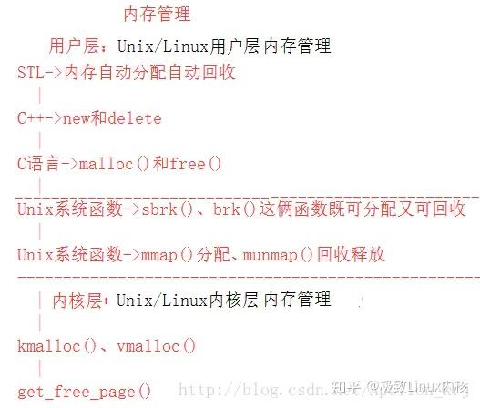
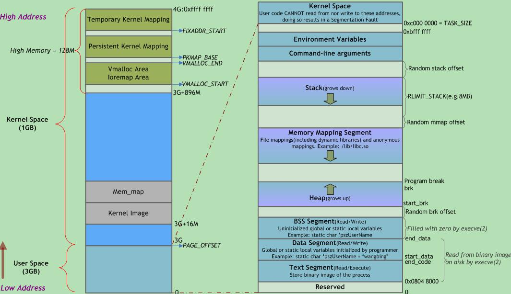

##### 内存管理



#### 进程虚拟内存



#### brk 和 sbrk

##### 函数原型

```c
#include<unistd.h>
int brk(void * addr); 
void * sbrk(intptr_t increment);
```


##### brk

程序中断点（program break）初始化值是未初始化的数据段的结束位置；

当brk参数中 addr 值合理并未超过最大允许范围时，将 program break 值设为 addr；

返回值：

- 0：成功！
- -1：失败，并设置 error 值为 ENOMEM；


##### sbrk

通过函数参数 increment 设置程序中断点的移动范围，当 increment值：

- 正：中断点向后移动，返回值为移动前位置；
- 0：返回当前中断点位置；
- 负：向前移动中断点，相当于释放内存，返回值无意义！


##### 使用

一般使用 sbrk 分配内存，使用brk释放内存。

```c
#include <stdio.h>
#include <stdlib.h>
#include <malloc.h>
#include <unistd.h>

#define SIZE 16

int main()
{
    void* old = sbrk(SIZE);
    for (int i = 0; i < SIZE; ++i) {
        *((char*)old) = 'c';
    }
    int ans = brk(old);
    if (ans == -1) {
        printf("release error!\n");
        exit(EXIT_FAILURE);
    } 
    else if (ans == 0) 
    {
        printf("release successful!\n");
    }
    return 0;
}
```


#### 调试过程

获取 exe_name 对应的进程 id：

```shell
ps -e | grep 'exe_name' | awk '{print $1}'
```

通过id 获得内存布局信息：

```shell
cat /proc/pid/maps
```


##### 代码1

```c
#include <stdio.h>
#include <malloc.h>
#include <unistd.h>

static void* addr;

int main()
{
    addr = sbrk(0);
    addr = sbrk(0);
    return 0;
}
```

针对 9、10 行断点调试，addr 值均为 `0x555555602000`；(看着像是废话)


##### 代码2

```c
#include <stdio.h>
#include <malloc.h>
#include <unistd.h>

static void* addr;

int main()
{
    addr = sbrk(0);
    printf("pid: %d\n", );
    addr = sbrk(0);
    return 0;
}
```

断点调试9、10、11行：

第9行执行完毕时，addr 值为：0x555555602000，此时查看进程内存布局：

```shell
555555400000-555555401000 r-xp 00000000 08:10 50993                      /home/cheng/Learning/sbrk_test
555555600000-555555601000 r--p 00000000 08:10 50993                      /home/cheng/Learning/sbrk_test
555555601000-555555602000 rw-p 00001000 08:10 50993                      /home/cheng/Learning/sbrk_test
7ffff79e2000-7ffff7bc9000 r-xp 00000000 08:10 2444                       /lib/x86_64-linux-gnu/libc-2.27.so
7ffff7bc9000-7ffff7dc9000 ---p 001e7000 08:10 2444                       /lib/x86_64-linux-gnu/libc-2.27.so
7ffff7dc9000-7ffff7dcd000 r--p 001e7000 08:10 2444                       /lib/x86_64-linux-gnu/libc-2.27.so
7ffff7dcd000-7ffff7dcf000 rw-p 001eb000 08:10 2444                       /lib/x86_64-linux-gnu/libc-2.27.so
7ffff7dcf000-7ffff7dd3000 rw-p 00000000 00:00 0 
7ffff7dd3000-7ffff7dfc000 r-xp 00000000 08:10 2420                       /lib/x86_64-linux-gnu/ld-2.27.so
7ffff7fed000-7ffff7fef000 rw-p 00000000 00:00 0 
7ffff7ff7000-7ffff7ffb000 r--p 00000000 00:00 0                          [vvar]
7ffff7ffb000-7ffff7ffc000 r-xp 00000000 00:00 0                          [vdso]
7ffff7ffc000-7ffff7ffd000 r--p 00029000 08:10 2420                       /lib/x86_64-linux-gnu/ld-2.27.so
7ffff7ffd000-7ffff7ffe000 rw-p 0002a000 08:10 2420                       /lib/x86_64-linux-gnu/ld-2.27.so
7ffff7ffe000-7ffff7fff000 rw-p 00000000 00:00 0 
7ffffffde000-7ffffffff000 rw-p 00000000 00:00 0                          [stack]
```


继续执行第10行，内存布局如下, 多出一条 [heap] 的记录：

```shell
555555400000-555555401000 r-xp 00000000 08:10 50993                      /home/cheng/Learning/sbrk_test
555555600000-555555601000 r--p 00000000 08:10 50993                      /home/cheng/Learning/sbrk_test
555555601000-555555602000 rw-p 00001000 08:10 50993                      /home/cheng/Learning/sbrk_test

555555602000-555555623000 rw-p 00000000 00:00 0                          [heap]

7ffff79e2000-7ffff7bc9000 r-xp 00000000 08:10 2444                       /lib/x86_64-linux-gnu/libc-2.27.so
7ffff7bc9000-7ffff7dc9000 ---p 001e7000 08:10 2444                       /lib/x86_64-linux-gnu/libc-2.27.so
7ffff7dc9000-7ffff7dcd000 r--p 001e7000 08:10 2444                       /lib/x86_64-linux-gnu/libc-2.27.so
7ffff7dcd000-7ffff7dcf000 rw-p 001eb000 08:10 2444                       /lib/x86_64-linux-gnu/libc-2.27.so
7ffff7dcf000-7ffff7dd3000 rw-p 00000000 00:00 0 
7ffff7dd3000-7ffff7dfc000 r-xp 00000000 08:10 2420                       /lib/x86_64-linux-gnu/ld-2.27.so
7ffff7fed000-7ffff7fef000 rw-p 00000000 00:00 0 
7ffff7ff7000-7ffff7ffb000 r--p 00000000 00:00 0                          [vvar]
7ffff7ffb000-7ffff7ffc000 r-xp 00000000 00:00 0                          [vdso]
7ffff7ffc000-7ffff7ffd000 r--p 00029000 08:10 2420                       /lib/x86_64-linux-gnu/ld-2.27.so
7ffff7ffd000-7ffff7ffe000 rw-p 0002a000 08:10 2420                       /lib/x86_64-linux-gnu/ld-2.27.so
7ffff7ffe000-7ffff7fff000 rw-p 00000000 00:00 0 
7ffffffde000-7ffffffff000 rw-p 00000000 00:00 0                          [stack]
```


执行第11行之后，会发现 addr 的值变为：**0x555555623000**， 即内存布局中heap的最后地址！

因此我们发现，在两个sbrk之间调用 printf，会更改 program break 的值。于是我们将 第10 行的printf 分别替换成一下代码：

1. ```c
   int num = 11;
   ```

2. ```c
   int *num = (int*)malloc(sizeof(int)); 
   *num = 11;
   ```

结论：

**代码1** 并不会更改 program break 的值， 同时内存布局中也不会出现heap的条目，原因可能是 num 作为局部变量，并不会在heap中保存；

**代码2** 会更改 program break的值（类似printf），同时内存布局中也会出现 heap的条目，原因是 num 作为指针指向 malloc 在heap 分配的内存！有意思的是，通过debug 发现 num 指向的heap 地址并不是 heap 起始地址 555555602000， 而是 0x555555602260！


