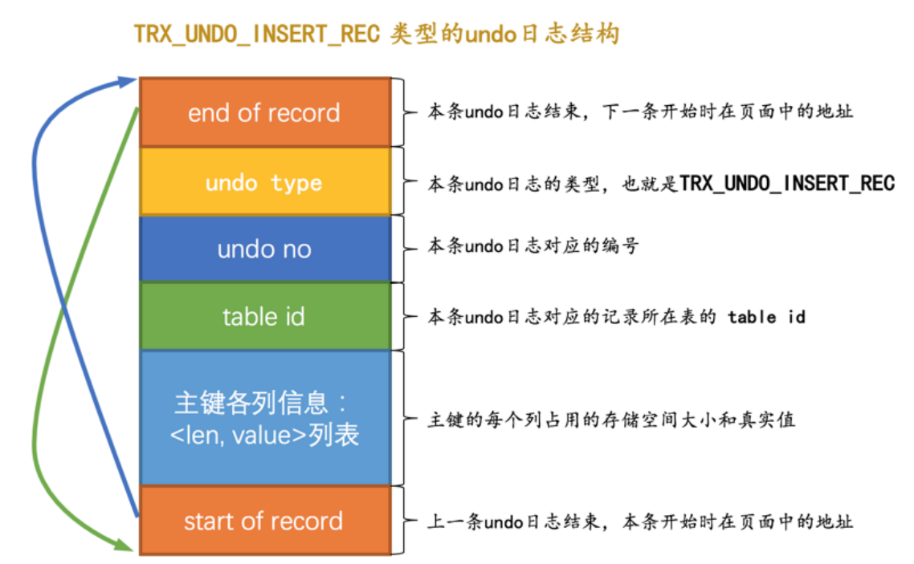
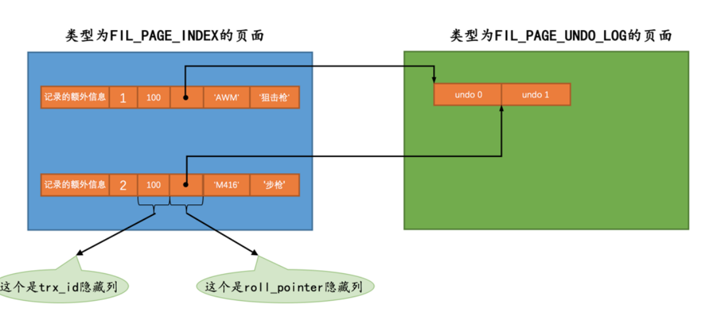

## 日志

### redo

> 如何保证持久性？个很简单的做法就是在事务提交完成之前把该事务所修改的所有页面都刷新到磁盘。
>
> - 刷新一个完整的数据页太浪费了；
> - 随机IO刷起来比较慢；

其实没有必要在每次事务提交时就把该事务在内存中修改过的全部页面刷新到磁盘，只需要把修改了哪些东西记录一下就好；

这样我们在事务提交时，把上述内容刷新到磁盘中，即使之后系统崩溃了，重启之后只要按照上述内容所记录的步骤重新更新一下数据页，那么该事务对数据库中所做的修改又可以被恢复出来；

- redo 日志占用空间很小；
- redo日志顺序写入磁盘；

因此： 

**redo 日志中只需要记录一下在某个页面的某个偏移量处修改了几个字节的值，具体被修改的内容是啥就好了**。

- 物理层面看，这些日志都指明了对哪个表空间的哪个页进行了修改；
- 逻辑层面看，在系统奔溃重启时，并不能直接根据这些日志里的记载，将页面内的某个偏移量处恢复成某个数据，而是需要调用一些事先准备好的函数，执行完这些函数后才可以将页面恢复成系统奔溃前的样子；


#### 格式

<div style="text-align:center">
    <image src="./image-20230926022858074-1695666540264-5.png" style="zoom:50%"/>
</div>


> - type ：该条 redo 日志的类型。
>
>   在 MySQL 5.7.21 这个版本中，设计 InnoDB 的大叔一共为 redo 日志设计了53种不同的类型;
>
>   - MLOG_8BYTE：表示在页面的某个偏移量处写入8个字节的 redo 日志类型；
>   - MLOG_WRITE_STRING：表示在页面的某个偏移量处写入一串数据；等等
>
> - space ID ：表空间ID。
>
> - page number ：页号。
>
> - data ：该条 redo 日志的具体内容。


#### 复杂的 redo 日志类型

以 insert 为例：

- 表中包含多少个索引，一条 INSERT 语句就可能更新多少棵 B+ 树；
- 针对某一棵 B+ 树来说，既可能更新叶子节点页面，也可能更新内节点页面，也可能创建新的页面；
- 可能更新 Page Directory 中的槽信息；
- Page Header 中的各种页面统计信息，比如 PAGE_N_DIR_SLOTS 表示的槽数量可能会更改， PAGE_HEAP_TOP代表的还未使用的空间最小地址可能会更改， PAGE_N_HEAP 代表的本页面中的记录数量可能会更改；
- 我们知道在数据页里的记录是按照索引列从小到大的顺序组成一个单向链表的，每插入一条记录，还需要更新上一条记录的记录头信息中的 next_record 属性来维护这个单向链表；


### undo

- 插入一条记录时，至少要把这条记录的主键值记下来，之后回滚的时候只需要把这个主键值对应的记录删掉就好了。

- 删除了一条记录，至少要把这条记录中的内容都记下来，这样之后回滚时再把由这些内容组成的记录插入到表中就好了。

- 修改了一条记录，至少要把修改这条记录前的旧值都记录下来，这样之后回滚时再把这条记录更新为旧值就好了


#### 事务id （trx_id）

- 对于只读事务来说，只有在它第一次对某个用户创建的临时表执行增、删、改操作时才会为这个事务分配一个 事务id ，否则的话是不分配 事务id 的；
- 对于读写事务来说，只有在它第一次对某个表（包括用户创建的临时表）执行增、删、改操作时才会为这个事务分配一个 事务id ，否则的话也是不分配 事务id 的；


##### 创建与恢复

- 服务器会在内存中维护一个全局变量，每当需要为某个事务分配一个 事务id 时，就会把该变量的值当作 事务id 分配给该事务，并且把该变量自增1。

- 每当这个变量的值为 256 的倍数时，就会将该变量的值刷新到系统表空间的页号为 5 的页面中一个称之为Max Trx ID 的属性处，这个属性占用 8 个字节的存储空间。

- 当系统下一次重新启动时，会将上边提到的 Max Trx ID 属性加载到内存中，将该值加上256之后赋值给我们前边提到的全局变量（因为在上次关机时该全局变量的值可能大于 Max Trx ID 属性值）。


#### insert

##### trx_undo_insert_rec  格式




##### 插入实例

```sql
INSERT INTO undo_demo(id, key1, col) VALUES (1, 'AWM', '狙击枪'), (2, 'M416', '步枪');
```

1. 第一条 undo日志 的 undo no 为 0 ，记录主键占用的存储空间长度为 4 ，真实值为 1;
2. 第二条 undo日志 的 undo no 为 1 ，记录主键占用的存储空间长度为 4 ，真实值为 2;


##### roll_pointer

本质上就是一个指向记录对应的 undo日志 的一个指针。




#### delete

- 正常记录链表：插入到页面中的记录会根据记录头信息中的 next_record 属性组成一个单向链表；
-  垃圾链表 ：被删除的记录其实也会根据记录头信息中的next_record 属性组成一个链表，Page Header 部分有一个称之为 PAGE_FREE 的属性，它指向由被删除记录组成的垃圾链表中的头节点；


##### 删除过程

1. 仅仅将记录的 delete_mask 标识位设置为 1；
2. 当该删除语句所在的事务提交之后，会有专门的线程后来真正的把记录删除掉：是把该记录从 正常记录链表 中移除，并且加入到 垃圾链表 中，然后还要调整一些页面的其他信息，比如页面中的用户记录数量 PAGE_N_RECS 、上次插入记录的位置PAGE_LAST_INSERT 、垃圾链表头节点的指针PAGE_FREE 、页面中可重用的字节数量 PAGE_GARBAGE 、还有页目录的一些信息等

因此：在删除语句所在的事务提交之前，只会经历 阶段一；（提交之后我们就不用回滚了）


