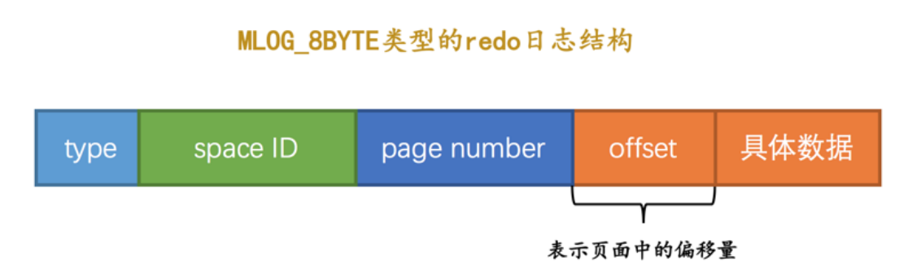

## 日志

### redo

> 如何保证持久性？个很简单的做法就是在事务提交完成之前把该事务所修改的所有页面都刷新到磁盘。
>
> - 刷新一个完整的数据页太浪费了；
> - 随机IO刷起来比较慢；

其实没有必要在每次事务提交时就把该事务在内存中修改过的全部页面刷新到磁盘，只需要把修改了哪些东西记录一下就好；

这样我们在事务提交时，把上述内容刷新到磁盘中，即使之后系统崩溃了，重启之后只要按照上述内容所记录的步骤重新更新一下数据页，那么该事务对数据库中所做的修改又可以被恢复出来；

- redo 日志占用空间很小；
- redo日志顺序写入磁盘；

#### 格式

> MLOG_8BYTE：表示在页面的某个偏移量处写入8个字节的 redo 日志类型；
>
> - type ：该条 redo 日志的类型。
>
>   在 MySQL 5.7.21 这个版本中，设计 InnoDB 的大叔一共为 redo 日志设计了53种不同的类型;
>
> - space ID ：表空间ID。
>
> - page number ：页号。
>
> - data ：该条 redo 日志的具体内容。