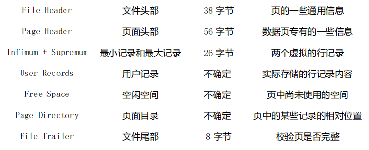

## 数据页

一个 InnoDB 数据页的存储空间：

<div>
    
    
</div>


##### 创建表：

```sql
create table page_demo (
	c1 INT,
    c2 INT,
    c3 VARCHAR(10000),
    primary key(c1)
) charset=ascii row_format=Compact;
```

##### 行格式：

<div style="text-align:center">
    <image src="./image-20230920144214305-1695192136716-3.png" style="zoom:80%"/>
    <image src="./image-20230920144316738.png" style="zoom:80%"/>
</div>


含义如下：

- delete_mask：被删除掉的记录都会组成一个所谓的 垃圾链表 ，在这个链表中的记录占用的空间称之为所谓的 可重用空间 ，之后如果有

  新记录插入到表中的话，可能把这些被删除的记录占用的存储空间覆盖掉；

- heap_no：表示当前记录在本 页 中的位置；系统自动给每个页里边儿加了两个记录，有时候也称为 伪记录 或者 虚拟记录 。这两个伪记录一个代表 最小记录 ，一个代表 最大记录；

- next_record：从当前记录的真实数据到下一条记录的真实数据的地址偏移量；**Infimum**记录（也就是最小记录） 的下一条记录就是

  本页中主键值最小的用户记录，而本页中主键值最大的用户记录的下一条记录就是 **Supremum**记录（也就是最大记录）；


#### 文件头部


#### 页面头部

结构如下：


#### 页目录

##### 创建

1. 将所有正常的记录（包括最大和最小记录，不包括标记为已删除的记录）划分为几个组；
2. 每个组的最后一条记录（也就是组内最大的那条记录）的头信息中的 n_owned 属性表示该组内共有几条记录；
3. 将每个组的最后一条记录的地址偏移量单独提取出来按顺序存储到Page Directory ，也就是 页目录；

##### 例子

<div style="text-align:center">
    <image src="./image-20231002151627875.png" style="zoom:60%"/>
</div>


##### 特点

- 最小记录所在的分组只能有 **1** 条记录；最大记录所在的分组拥有的记录条数只能在 **1~8** 条之间，剩下的分组中记录的条数范围只能在是 **4~8** 条之间；

- 所有正常的记录（包括最大和最小记录，不包括标记为已删除的记录）划分为几个组；
-  每个组的最后一条记录（也就是组内最大的那条记录）的头信息中的 n_owned 属性表示该组内共有几条记录；
-  将每个组的最后一条记录的**地址偏移量**单独提取出来按顺序存储到靠近 页 的尾部的地方；

##### 工作过程

1. 初始情况下一个数据页里只有最小记录和最大记录两条记录，它们分属于两个分组；
2. 之后每插入一条记录，都会从 页目录 中找到主键值比本记录的主键值大并且差值最小的槽，然后把该槽对应的记录的 n_owned 值加1，表示本组内又添加了一条记录，直到该组中的记录数等于8个；
3. 在一个组中的记录数等于8个后再插入一条记录时，会将组中的记录拆分成两个组，一个组中4条记录，另一个5条记录。这个过程会在 页目录 中新增一个 槽 来记录这个新增分组中最大的那条记录的偏移量；

然后查找的时候，就可以使用 二分法 对槽进行查找；


#### File Trailer

用于检验页是否完整，即同步到一半时有无断电这种异常情况。由 8 个字节组成，可以分成2个小部分：

##### 校验和 - 4 B

每当一个页面在内存中修改了，在同步之前就要把它的校验和算出来，因为 File Header 在页面的前边，所以校验和会被首先同步到磁盘，当完全写完时，校验和也会被写到页的尾部；

- 如果完全同步成功，则页的首部和尾部的校验和应该是一致的；

- 如果写了一半儿断电了，那么在 File Header 中的校验和就代表着已经修改过的页，而在 File Trialer 中的校验和代表着原先的页，二者不同则意味着同步中间出了错；
