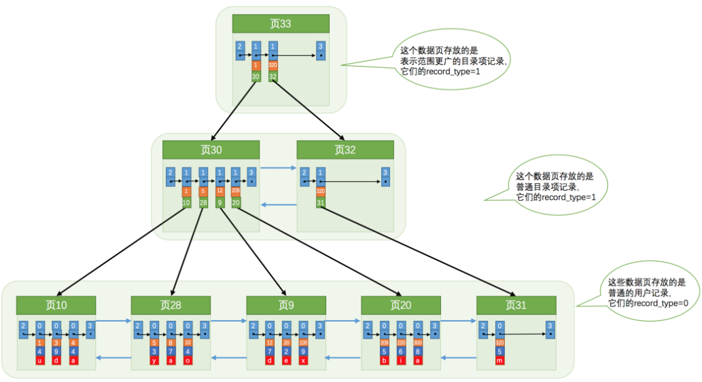
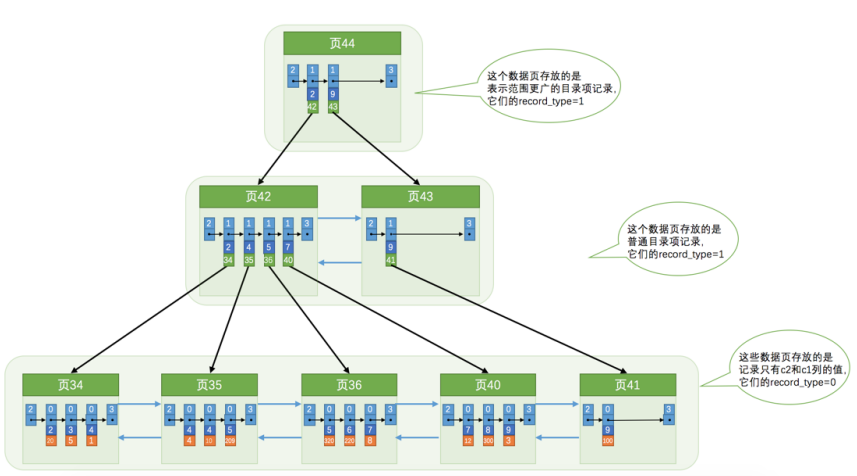

### 索引

大致内容：



#### 创建过程

1. 每当为某个表创建一个 B+ 树索引（聚簇索引不是人为创建的，默认就有）的时候，都会为这个索引创建一个 根节点 页面。最开始表中没有数据的时候，每个 B+ 树索引对应的 根节点 中既没有用户记录，也没有目录项记录；
2. 随后向表中插入用户记录时，先把用户记录存储到这个 根节点；
3. 当 根节点 中的可用空间用完时继续插入记录，此时会将 根节点 中的所有记录复制到一个新分配的页，比如 页a 中，然后对这个新页进行 页分裂 的操作，得到另一个新页，比如 页b 。这时新插入的记录根据键值（也就是聚簇索引中的主键值，二级索引中对应的索引列的值）的大小就会被分配到 页a 或者 页b 中，而根节点 便升级为存储目录项记录的页。

一个B+树索引的根节点自诞生之日起，便不会再移动。

#### 联合索引

为 c2 列建立的二级索引对应的 B+ 树：



##### 问题1:

如上图所示，如果我们想新插入一行记录，其中 c1 、 c2 、 c3 的值分别是： 9 、 1 、 'c' ：由于 页3 中存储的目录项记录是由 c2列 + 页号 的值构成的，页3 中的两条目录项记录对应的 c2 列的值都是 1 ，而我们新插入的这条记录的 c2 列的值也是 1 ，那我们这条新插入的记录到底应该放到 页4 中，还是应该放到 页5 中啊？

SOLUTION：

目录项记录：索引列值 & 主键值 & 页号


##### 全值匹配

```sql
SELECT * FROM person_info WHERE name = 'Ashburn' AND birthday = '1990-09-27' AND phone_number = '15123983239';
```

- 因为 B+ 树的数据页和记录先是按照 name 列的值进行排序的，所以先可以很快定位 name 列的值是 Ashburn的记录位置。

- 在 name 列相同的记录里又是按照 birthday 列的值进行排序的，所以在 name 列的值是 Ashburn 的记录里又可以快速定位 birthday 列的值是 '1990-09-27' 的记录。
- 如果很不幸， name 和 birthday 列的值都是相同的，那记录是按照 phone_number 列的值排序的，所以联合索引中的三个列都可能被用到。


##### 匹配最左

用不到这个 B+ 树索引.

常见情况：

1. 用得到：SELECT * FROM person_info WHERE birthday = '1990-09-27';
2. 用得到：rson_info WHERE name LIKE 'As%'; 
3. 未使用到：SELECT * FROM person_info WHERE name LIKE '%As%';


##### 匹配范围

```sql
SELECT * FROM person_info WHERE name > 'Asa' AND name < 'Barlow' AND birthday > '1980-01-01';
```

1. 通过条件 name > 'Asa' AND name < 'Barlow' 来对 name 进行范围，查找的结果可能有多条 name 值不同的记录;
2. 对这些 name 值不同的记录继续通过 birthday > '1980-01-01' 条件继续过滤;

只能用到 name 列的部分，而用不到 birthday 列的部分.


