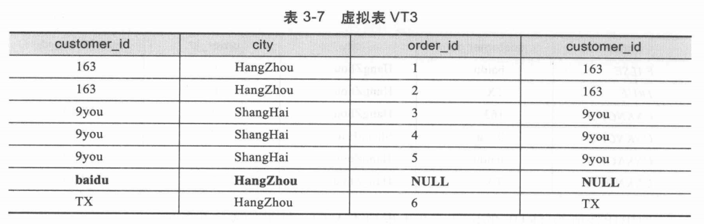

#### 查询细节

##### customers


##### orders


##### 查询来自杭州订单数少于2的客户

```sql
select C.customer_id, count(O.order_id) as total_orders
from customers as C  
LEFT JOIN orders as O on C.customer_id = O.customer_id
where C.city = 'HangZhou' 
group by C.customer_id
having count(O.order_id) < 2
order by total_orders;
```


#### 详细过程

##### 1. from 

两个表执行笛卡尔积操作，虚拟表 VT1 产生 m * n  行数据；


##### 2. on

产生虚拟表VT2时，会增加一个额外的列表示ON 过滤条件的返回值，即TRUE，FALSE，UNKNOWN。部分如下：


然后取出TRUE的记录，产生VT2虚拟表。


##### 3. 添加外部行

在VT2的基础上，添加保留表中被过滤条件过滤掉的数据，非保留表中的数据设为 NULL，生成 VT3；

比如顾客 baidu 由于没有订单信息，在 on 过滤中，match 结果为 UNKNOWN，因此被过滤掉；但同时作为保留表的customers，含有baidu的信息，因此添加baidu信息，并将 order 内容设置为 NULL。

