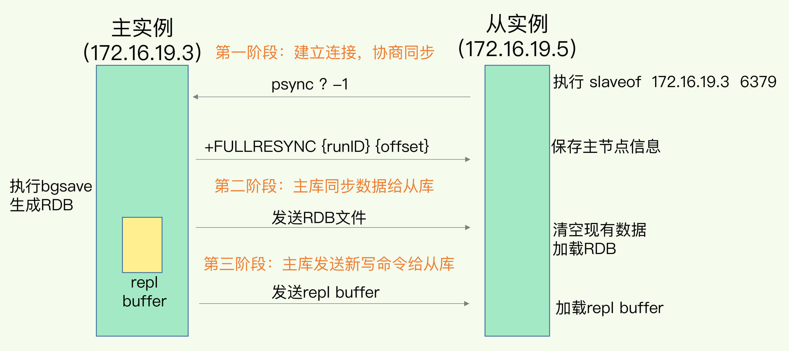

#### 主从库模式 

##### 读写分离

- 读：主库、从库都可以接收；
- 写：首先到主库执行，然后，主库将写操作同步给从库；

##### 同步过程

1. 主从库间建立连接、协商同步的过程，主要是为全量复制做准备；
   1. 从库向主库发送 psync 命令：
      - runID：每个 Redis 实例启动时都会自动生成的一个随机 ID；
      - offset：-1，表示第一次复制；
   2. 主库用 FULLRESYNC 响应命令带上两个参数：主库 runID 和主库目前的复制进度 offset，返回给从库；
2. 主库将所有数据同步给从库。从库收到数据后，在本地完成数据加载，过程依赖于 RDB 文件；
   1. 主库执行 bgsave 命令，生成 RDB 文件，接着将文件发给从库；
   2. 从库接收到 RDB 文件后，会先清空当前数据库，然后加载 RDB 文件；
3. 主库会把第二阶段执行过程中新收到的写命令，再发送给从库。当主库完成 RDB 文件发送后，就会把此时 replication buffer 中的修改操作发给从库，从库再重新执行这些操作。这样一来，主从库就实现同步了。

> 在主库将数据同步给从库的过程中，主库不会被阻塞，仍然可以正常接收请求。这些请求中的写操作并没有记录到刚刚生成的 RDB 文件中。为了保证主从库的数据一致性，主库会在内存中用专门的 **replication buffer**，记录 RDB 文件生成后收到的所有写操作.

##### 缺点

一次全量复制中，对于主库来说，需要完成两个耗时的操作：生成 RDB 文件和传输 RDB 文件。

- 如果从库数量很多，主库忙于 fork 子进程生成 RDB 文件，进行数据全量同步。fork 这个操作会阻塞主线程处理正常请求，从而导致主库响应应用程序的请求速度变慢；
- 传输 RDB 文件也会占用主库的网络带宽，同样会给主库的资源使用带来压力；

#### 主从级联模式

在部署主从集群的时候，可以手动选择一个从库（比如选择内存资源配置较高的从库），用于级联其他的从库；

在进行同步时，不用再和主库进行交互了，只要和级联的从库进行写操作同步就行了，这就可以减轻主库上的压力；

#### 网络断开

一旦主从库完成了全量复制，它们之间就会一直维护一个网络连接，主库会通过这个连接将后续陆续收到的命令操作再同步给从库，这个过程也称为**基于长连接的命令传播**，可以避免频繁建立连接的开销。

##### 断开后同步

- 当主从库断连后，主库会把断连期间收到的写操作命令，写入 **replication buffer**，同时也会把这些操作命令也写入 **repl_backlog_buffer** 这个缓冲区；

  > repl_backlog_buffer 是一个环形缓冲区，**主库会记录自己写到的位置 (master_repl_offset)，从库则会记录自己已经读到的位置 (slave_repl_offset)**。

- 主从库的连接恢复之后：

  - 从库首先会给主库发送 psync 命令，并把自己当前的 slave_repl_offset 发给主库，
  - 主库会判断自己的 master_repl_offset 和 slave_repl_offset 之间的差距，只用把 master_repl_offset 和 slave_repl_offset 之间的命令操作同步给从库就行

#### 总结

##### redis 实例数据库不要太大

- 可以减少 RDB 文件生成、传输和重新加载的开销；
- 避免多个从库同时和主库进行全量复制，给主库过大的同步压力；

##### repl_backlog_size 

如果它配置得过小，在增量复制阶段，可能会导致从库的复制进度赶不上主库，进而导致从库重新进行全量复制。

所以，通过调大这个参数，可以减少从库在网络断连时全量复制的风险。