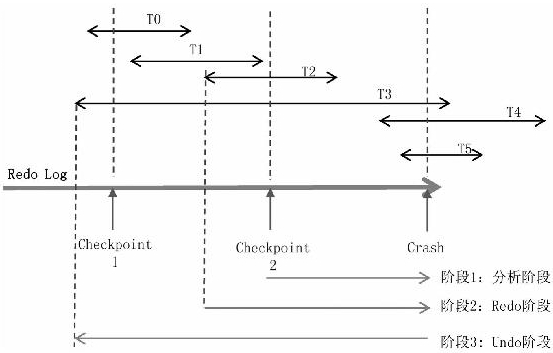

## 数据库

#### 分库分表

通过将数据分散存储在多个数据库实例（分库）和表中（分表），可以提高系统的并发处理能力和数据的存储容量。

- 业务拆分与扩展：通过RPC或消息中间件通信，既便于团队成员的职责分⼯，也便于对未来某个系统进⾏扩展；
- 应对高并发：
  - 如果是读多写少，可以通过加从库、加缓存解决；
  - 如果是读少写多，或者说写⼊的QPS已经达到了数据库的瓶颈，这时就要考虑分库分表了；
- 数据隔离：如果把核⼼业务数据和⾮核⼼业务数据放在⼀个库⾥，不分轻重，同等对待。⼀旦因为⾮核⼼业务导致数据库宕机，核⼼业务也会受到牵连；


##### 场景-如何拆分

订单ID、⽤户ID、商户ID。

假设按⽤户ID维度拆分，同⼀个⽤户ID的所有订单会落到同⼀个库的同⼀张表⾥。当查询的时候，按⽤户 ID 查，可以很容易地定位到某个库的某个表；但如果按订单 ID 或商户 ID维度查询，就很难做。

- 建立映射表：

  1. 查询的时候根据商户ID查询映射表，得到⽤户**ID**；
  2. 再根据⽤户ID查询订单ID；

- 业务双写：两套分库分表，⼀套按⽤户ID切分，⼀套按商户ID 切分；

- 异步双写：业务单写，然后通过监听Binlog，同步到另外⼀套表上；

- 统一维度

  > ⽐如把⽤户ID作为订单ID中的某⼏位，这样订单ID中就包含了⽤户ID信息，然后按照⽤户ID 分库，当按订单ID查询的时候，截取出⽤户ID，再按⽤户 ID查询


##### join 问题

- Join拆成多个单表查询，在代码层对结果进⾏拼装；

- 做成宽表，空间换时间；

  > 宽表（Wide Table）是指具有大量列的表结构。
  >
  > 宽表的设计思想是将多个属性或字段合并到一个表中，以减少表之间的关联和连接操作。通过将相关属性直接存储在同一行的不同列中，宽表可以提供更快的数据访问和查询性能。
  >
  > 应用领域：
  >
  > - 日志分析；
  > - 电商商品表；

- 利用搜索引擎；


### 事务与锁

#### 快照读写

MVCC解决了快照读和写之间的并发问题，但对于写和写之间、当前读和写之间的并发，MVCC就无能为力了，这时就需要用到锁。

##### 快照读：读取操作基于数据库的快照

当进行快照读取时，数据库引擎会创建一个一致性的快照，并从该快照中读取数据。这意味着即使在读取过程中有其他事务对数据进行修改，读取操作也不会看到这些修改；

快照读取提供了读取操作的一致性视图，确保读取的数据是在同一时间点的一致状态。


##### 快照写：写入操作基于数据库的快照

当进行快照写入时，数据库引擎会创建一个副本（快照）并在该副本上执行写入操作。

写入操作在副本上进行，这可以确保其他并发事务不会受到写入操作的影响，直到副本被确认为新的数据库状态。一旦副本被确认，它将成为数据库的新快照。

#### 单条语句的原子性

对于扣钱的事务，一般先把数据select后，再进行update，但是没有办法保证两条语句的原子性。可以改为一条语句：

```sql
UPDATE record SET count = count - 50 WHERE id = 1;
```

局限性：实际业务中，往往需要先获得表中的值，再进行更新。


#### 悲观锁

认为数据发⽣并发冲突的概率很⼤，所以读之前就上锁。

`SELECT ... FOR UPDATE` 的作用是获取选定行的共享锁（Shared Lock）或排他锁（Exclusive Lock），这取决于数据库的事务隔离级别：

- 共享锁允许其他事务同时读取选定行，但阻止其他事务对选定行进行修改；
- 排他锁则阻止其他事务对选定行进行读取或修改；

问题：

- 假如事务 A 在拿到锁之后、Commit 之前出问题了，会造成锁不能释放，数据库死锁；
- ⼀个事务拿到锁之后，其他访问该记录的事务都会被阻塞，这在⾼并发场景下会造成⽤户端的⼤量请求阻塞；


#### 乐观锁

认为数据发⽣并发冲突的概率⽐较⼩，所以读之前不上锁，等到写回去的时候再判断数据是否被其他事务改了。

以下是实现乐观锁的一般步骤：

1. 添加版本号或时间戳字段：在表中添加一个额外的字段，用于记录每次更新的版本号或时间戳。例如，可以使用整数类型的版本号字段或时间戳字段。
2. 查询数据：在事务开始时，先查询需要更新的数据，并获取当前的版本号或时间戳。
3. 执行业务逻辑：在事务中执行您的业务操作，对数据进行修改或计算。
4. 更新数据：在更新数据之前，检查之前获取的版本号或时间戳是否与当前数据库中的值一致。
   - 如果一致，说明没有其他并发事务修改过数据，可以继续执行更新操作，并将版本号或时间戳加一。
   - 如果不一致，说明其他并发事务已经修改了数据，可能存在冲突。您可以选**择终止当前事务**，或者根据具体业务需求进行处理，例如**重新读取数据并重试操作**。


```sql
START TRANSACTION;

SELECT xx, version FROM record WHERE condition;
-- 执行您的业务逻辑，并对数据进行修改
UPDATE record SET xx = new_value, version = version + 1 WHERE condition AND version = old_version;

COMMIT;
```

___


#### 间隙锁

间隙锁（Gap Lock）是一种锁定**索引范围**而不是特定行的机制。它用于在多个事务并发访问数据库时，保护索引范围内的间隙，防止其他事务插入或修改数据时破坏特定范围的完整性。

##### 分类

共享间隙锁（S-gap lock）和独占间隙锁（X-gap lock）。

- S-gap lock 允许其他事务获取相同间隙的 S-gap lock，但不允许其他事务获取 X-gap lock；
- X-gap lock 则是排它锁，其他事务无法获取相同间隙的任何类型的锁；


##### 工作过程

- 当一个事务获取间隙锁时，它会锁定索引范围内的间隙，包括但不限于两个索引值之间的空隙。这意味着其他事务无法在这个间隙内插入新的索引值；
- 在 InnoDB 中，间隙锁与行锁可以同时存在。当一个事务获取了一个间隙锁时，它也可以获取间隙内的行锁。这样可以确保事务在索引范围内的间隙和行都受到保护，防止其他事务插入或修改数据。

```sql
# 事务a
BEGIN;
SELECT * FROM products WHERE price BETWEEN 100 AND 200 FOR UPDATE;

# 事务b
BEGIN;
INSERT INTO products (id, name, price) VALUES (102, 'Product 102', 150);
COMMIT;
```

在事务 A 的 `SELECT` 语句中，使用了间隙锁来保护价格范围在 100 到 200 之间的产品。

事务 B 在插入一行新的产品（id 为 102）时，由于事务 A 持有了间隙锁，事务 B 会被阻塞，直到事务 A 释放间隙锁或回滚。


##### 应用场景

间隙锁的一个典型应用场景是防止**幻读**（Phantom Read）的发生。幻读指的是在同一个事务中，多次执行相同的查询，但结果集却发生了变化。通过使用间隙锁，MySQL 可以锁定索引范围，确保在同一个事务中执行相同查询时，其他事务无法在该范围内插入新的行，从而避免了幻读的问题。

需要注意的是，间隙锁只在某些隔离级别下才会生效，如 Repeatable Read (RR) 和 Serializable (SER) 隔离级别。

___


#### 死锁

- 死锁检测：通过判断资源图有无环判断是否死锁；

- 死锁解除：可以强制事务回滚；

- 死锁场景：
  - 事务A操作了表T1、T2的两条记录，事务B也操作了表T1、T2中同样的两条记录，顺序刚好反过来，可能发⽣死锁；
  
  - 两个事务持有不同间隙锁：
  
    > 事务 A 持有间隙锁锁定了间隙 G1-G2，事务 B 持有间隙锁锁定了间隙 G3-G4，同时事务 A 需要获取间隙 G3-G4 的间隙锁，而事务 B 需要获取间隙 G1-G2 的间隙锁，它们会相互等待对方所持有的锁而无法继续执行，导致死锁的发生。

___


### redo log

每个Redo Log Block是512字节：早期的磁盘，⼀个扇区（最细粒度的磁盘存储单位）就是存储512字节数据；

#### write-ahead

⼀个事务要修改多张表的多条记录，多条记录分布在不同的Page⾥⾯，对应到磁盘的不同位置。如果每个事务都直接写磁盘，⼀次事务提交就要多次磁盘的随机I/O.

write-ahead log 思路：

1. 内存中提交事务；
2. 写日志：
   1. 先写入内存中的redo log buffer 中；
   2. 再异步地刷到磁盘的 redo log；
3. 将内存中的数据异步刷到磁盘上；


> 一旦事务成功提交并将修改操作持久化到磁盘上的 redo log 文件中，MySQL 可以删除事务相关的 redo log 记录;
>
> 删除操作通常发生在崩溃恢复过程中。当数据库系统在崩溃后重新启动时，会根据 redo log 文件中的信息进行恢复操作。一旦所有已提交的事务都已经成功应用到数据库中，相关的 redo log 记录就可以被删除。


#### Physiological Logging

真实的场景是这样的：

当事务执行过程中，redo 日志和 内存中的数据（页）异步地写入磁盘；当出现断电等异常情况时，内存中的数据（脏页）未刷盘。如何通过redo日志来将内存中的脏页重新刷盘（可能脏页中的数据涉及的事务已经提交，也有可能没有提交）。redo 日志的设计有两个方向：

逻辑日志 与 物理日志：⼀条逻辑⽇志可能产⽣多个Page的物理⽇志；

> ⽐如往某个表中插⼊⼀条记录，逻辑上是⼀条⽇志，但物理上可能会操作两个以上的 Page。

在实际磁盘上面，一个逻辑事务对应的日志不是连续的，但一个物理事务（Mtr）对应的日志一定是连续的（即使横跨多个Block）。

**逻辑记法：**

- 类似 binlog 的 statement：记录原始的sql语句：insert / delete / update
- 类似 binlog 的 raw：记录每张表的每条记录的修改前的值、修改后的值；

⼀条记录牵涉的多个Page写到⼀半系统宕机了，要恢复的时候很难知道到底哪个Page写失败了；

即使1条逻辑⽇志只对应⼀个Page，也可能要修改这个Page的多个地⽅。因为⼀个Page⾥⾯的记录是⽤链表串联的，所以如果在中间插⼊⼀条记录，不仅要插⼊数据，还要修改记录前后的链表指针。对应到Page就是多个位置要修改，会产⽣多条物理⽇志；

**物理记法**：

- 记录page的字节数据：(page_id, offset1, len1, old_val, new_val);
- 一条逻辑日志可能对应多条物理日志，因为涉及到该页多段不连续的内存；

 **Physiological Logging** ：

- 逻辑记法和物理记法的结合；
- 先以Page为单位记录⽇志，每个Page⾥⾯再采取逻辑记法（记录Page⾥⾯的哪⼀⾏被修改了）
- 每个 page 的修改对应一个 Mtr（mini transaction，物理事务）


___


#### redo log block

头部有12字节，尾部Check sum有4个字节，所以实际一个Block能存的日志数据只有496字节.

- Block No：每个Block的唯一编号;
- Date Len：该Block中实际日志数据的大小，可能496字节没有存满;
- First Rec Group：该 Block 中第一条日志的起始位置，可能因为上一条日志很大，上一个Block没有存下，日志的部分数据到了当前的Block。如果First Rec Group=Data Len，则说明上一条日志太大，大到横跨了上一个Block、当前Block、下一个Block，当前Block中没有新日志;
- Checkpoint No：当前Block进行Check point时对应的LSN; (LSN（Log Sequence Number）是逻辑上日志按照时间顺序从小到大的编号)

##### 工作过程

<div style="text-align:center">
    <image src="./CB_9Bi3j83isGzE6jM6kfBpsBMQ_00091-1696517964094-3.jpeg" /> <br>
    <text>事务与redo log</text> <br>
    <image src="./CB_9Bi3j83isGzE6jM6kfBpsBMQ_00092.jpeg"/> <br>
	<text>多个事务</text>
</div>
不同事务的日志在物理磁盘上是交叉存在的；未提交的事务的日志也在 redo log 中；

当事务1提交时，其redo log 会刷到磁盘上，夹杂的其他事务的redo log 也会刷到磁盘上；


 #### aries 算法（崩溃恢复）



##### 问题

- 哪些数据页是脏页？

  > 宕机时，虽然T0、T1、T2已经提交了，但只是Redo Log在磁盘上，其对应的数据Page是否已经刷到磁盘上?

- 哪些事务未提交？

  > 即如何判断redo log 中的部分事务日志有无提交。

##### 1. checkpoint 

即所谓的快照机制。

活跃事务表：当前所有未提交事务的集合

- tx_id：事务id
- lastLSN：事务产生的日志中最后一条日志的 LSN；

> checkpoint2时，首先遇到了T2的结束标识，把T2从集合中移除，剩下{T3}；之后遇到了事务T4的开始标识，把T4加入集合，集合变为{T3，T4}；之后遇到了事务T5的开始标识，把T5加入集合，集合变为{T3，T4，T5}。最终直到末尾，没有遇到{T3，T4，T5}的结束标识，所以未提交事务是{T3，T4，T5}。


脏页表：所有未刷到磁盘上的page集合

- page_no：页号
- recoveryLSN：导致该Page为脏页的最早的 LSN；

这两个表记录的全是ID，数据量很小，很容易备份；每一次 Fuzzy Checkpoint，就把两个表的数据生成一个快照，形成一条Checkpoint日志，记入Redo Log。

> 假设在Checkpoint2的时候，脏页的集合是{P1，P2}。从Checkpoint开始，一直遍历到Redo Log末尾，一旦遇到Redo Log操作的是新的Page，就把它加入脏页集合，最终结果可能是{P1，P2，P3，P4}


##### 2. redo 操作：保证脏页写入磁盘

根据 checkpoint 获取脏页集合，同时获取recoveryLSN 的最小值，从该最小值遍历 redo log 到末尾，每条 redo log 对应的 page 重新刷盘；

redo 完成后，就保证了所有的脏页都成功地写入到了磁盘，干净页也可能重新写入了一次；（**接下来要做的就是对未提交的事务进行回滚**）

> 每个page都有一个关键字段 - pageLSN： 记录的是这个 Page 刷盘时最后一次修改它的日志对应的 LSN，如果重放日志的时候，日志的 LSN ＜=pageLSN，则不修改日志对应的Page，略过此条日志。
>
> 比如page被多个事务修改了多次，lsn分别为 n1、n2、n3。
>
> - 内存中，pageLSN记录的是 n3；
> - 磁盘中，pageLSN记录的是n2；
>
> 重启时，所以＜ n2 的 LSN对应的日志，都会被忽略掉，只有 lsn = n3的这条日志对应的修改操作会作用到该 page 中。


##### 3. undo 操作

- redo 通过redo日志，将内存中尚未刷盘的脏页重新刷盘；
- undo 通过 redo 日志，将日志中未提交的事务回滚，保证原子性；

过程：

1. 通过checkpoint，获取未提交的事务集合；
2. 从最后一条日志逆向遍历（prevLSN 字段），沿着未提交事务各自的日志回溯；
   - 每遇到一条属于未提交的集合中的日志，则生成一条逆向的 SQL 语句；
   - 执行对应的redo log 会在 redo log 尾部继续追加（对于redo log 来讲，全部是正向的 commit）；

> 回滚的回滚：
>
> 假设要回滚一个未提交的事务T，其有三条日志LSN分别为600、900、1000。
>
> 第一次宕机重启，首先对LSN=1000进行回滚，生成对应的LSN=1200的日志，这条日志里会有一个字段叫作 UndoNxtLSN，记录的是其对应的被回滚的日志的前一条日志，即UndoNxtLSN=900。
>
> 这样当再一次宕机重启时，遇到LSN=1200的CLR：
>
> 1. 首先看到UndoNxtLSN=900，会忽略这条日志；
> 2. 然后定位到LSN=900的日志，为其生成对应的CLR日志LSN=1600；
> 3. 然后继续回滚的是LSN=600，并为其生成新的 LSN。


#### io写入原子性

如何判断 **log block** 是否写入成功？比如当前512B的数据块，在写的过程中断电，读取时如何判断该块不合法

> 引入 checknum 机制：
>
> 1. 在写入 log block 之前，计算 log block 数据的 checksum 值（如 CRC32 计算校验和）；
> 2. 将生成的 checksum 值附加到 log block 中，通常作为一部分元数据；
> 3. 在读取 log block 时，从磁盘中读取 log block 数据和附加的 checksum 值；
> 4. 对读取的 log block 数据重新计算 checksum 值，使用相同的校验算法，并对读取的 checknum 和计算结果比较；

如何判断 `page` 写入成功？即大小16KB 的page写入过程中断电

> 同样引入 checknum 机制，但是只能判断当前页写入失败。

解决办法：

1. 硬件支持 16KB 的原子操作；
2. double write：首先将 16kb 写入临时的磁盘位置，成功后拷贝都目标磁盘位置；


#### SUMMARIZE

- 一个事务对应多条Redo Log，事务的Redo Log不是连续存储的。
- Redo Log不保证事务的原子性，而是保证了持久性。无论提交的，还是未提交事务的日志，都会进入Redo Log。从而使得Redo Log回放完毕，数据库就恢复到宕机之前的状态，称为Repeating History。
-  同时，把未提交的事务挑出来并回滚。回滚通过Checkpoint记录的“活跃事务表”+每个事务日志中的开始/结束标记+Undo Log 来实现。
- Redo Log具有幂等性，通过每个Page里面的pageLSN实现。·
- 无论是提交的、还是未提交的事务，其对应的 Page 数据都可能被刷到了磁盘中。未提交的事务对应的Page数据，在宕机重启后会回滚。
- 事务不存在“物理回滚”，所有的回滚操作都被转化成了Commit

___


### undo log

- Undo Log没有顺序，多个事务是并行地向Undo Log中随机写入的
- 一个事务一旦 Commit 之后，数据就“固化”了，固化之后不可能再回滚。这意味着Undo Log只在事务Commit过程中有用，一旦事务Commit了，就可以删掉Undo Log；

Page中的每条记录，除了自身的主键ID和数据外，还有两个隐藏字段：一个是修改该记录的事务ID，一个是rollback_ptr，用来串联所有的历史版本。

#### 工作内容

- insert：对于insert记录，没有历史版本数据，因此insert的Undo Log只记录了该记录的主键ID，当事务提交之后，该Undo Log就可以删除了
- 对于update/delete记录，因为MVCC的存在，其历史版本数据可能还被当前未提交的其他事务所引用，一旦未提交的事务提交了，其对应的Undo Log也就可以删除了

#### 刷盘模式

- steal / no steal：未提交的事务能否刷盘；
- force / no force：提交的事务是否一定刷盘；

no force && steal （innodb）：一经提交的事务可以不立即刷盘 && 未提交的事务也可以刷盘。


##### 并发读写策略

copyOnWrite：写的时候，把该数据备份一份，等写完之后，再把数据对象的指针一次性赋值过来。

innodb中，每个事务修改记录之前，都会先把该记录拷贝一份出来，拷贝出来的这个备份存在Undo Log里。


#### 与 redo log 关联

Redo Log记录的是对数据的修改，凡是对数据的修改，都必须记入Redo Log。

```shell
start transaction
update tb1 某行；
delete tb1 某行；
insert tb2 某行；
commit;
```

实际工作细节：

```shell
start transaction
	写 undo log1：备份该行数据；
	update tb1 某行；
	写 redo log1；
	
	写 undo log2：备份改行数据；
	delete tb1 某行；
	写 redo log2；
	
	写 undo log3：记录改行主键；
	insert tb2 某行；
	写 redo log3；
commit；
```


### binlog

- Redo Log和Undo Log是InnoDB引擎里面的工具，但Binlog是MySQL层面的东西；
- Binlog的主要作用是做主从复制，如果是单机版的，没有主从复制，也可以不写Binlog；
- 在互联网应用中，Binlog有了第二个用途：一个应用进程把自己伪装成Slave，监听Master 的Binlog，然后把数据库的变更以消息的形式抛出来，业务系统可以消费消息，执行对应的业务逻辑操作，比如更新缓存；


#### 刷盘时机

sync_binlog：

- 0：事务提交之后不主动刷盘，依靠操作系统自身的刷盘机制可能会丢失数据。
- 1：每提交一个事务，刷一次磁盘。
- n：每提交n个事务，刷一次磁盘

在不发生宕机的情况下，未提交的事务、回滚的事务，其日志都不会进入Binlog。


#### 与 redo log

| 差异                     | redo log   | bin log  |
| ------------------------ | ---------- | -------- |
| 日志格式                 | physnology | 逻辑日志 |
| 同一事务的日志是否连续   | 否         | 是       |
| 是否可以并发写入         | 是         | 否       |
| 未提交事务是否写入       | 是         | 否       |
| 已回滚的事务日志是否写入 | 是         | 否       |

Binlog 全局只有一份，每个事务都要串行地写入，这意味着每个事务在写Binlog之前要拿一把全局的锁，才能保证每个事务的Binlog是连续写入的。


#### 主从复制模式

- 同步
- 异步
- 半同步
