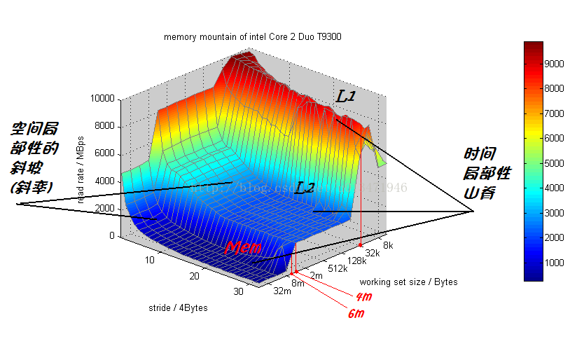

##### 常见概念

- 工作集：一次性读取的数据；

- 步长：上一次和下一次读取数据之间存储距离：

    - 实例一：

        ```c
        int sum1(int a[M][N])
        {
            int i, j, sum = 0;
            for(i = 0;i < M;i++)
                for(j = 0;j < N;j++)
                    sum += a[i][j];
            return sum;
        }
        ```

    - 实例二：

        ```c
        int sum2(int a[M][N])
        {
            int i, j, sum = 0;
            for(j = 0;j < N;j++)
                for(i = 0;i < M;i++)
                    sum += a[i][j];
            return sum;
        }
        ```

    前者通过行遍历，步长为1；后者则通过列遍历，步长为N；

#### 储存器山

 

- 左边坐标是步长（stride），按字计算（4个字节）；
- 右边坐标是工作集（working set size）；
- z轴为系统吞吐量；


