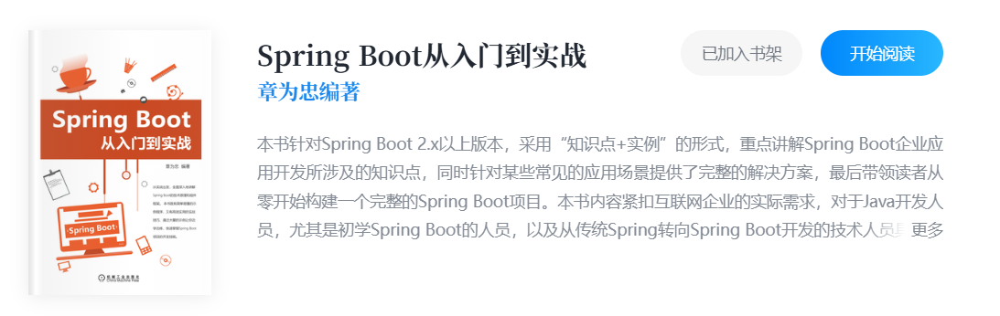

快速入门书籍（先知道怎么用）：

然后稍微深一点（但是不太深，可以快速过一下springboot，然后大概的学一下springcloud）：

[Spring Cloud开发 - 廖雪峰的官方网站 (liaoxuefeng.com)](https://www.liaoxuefeng.com/wiki/1252599548343744/1266263401691296)

> https://www.liaoxuefeng.com/wiki/1252599548343744/1266263401691296

redis：

个人觉得写的最好的：[极客时间-Redis核心技术与实战: Redis核心技术与实战 来自极客时间 (gitee.com)](https://gitee.com/Rysek/Redis)

> https://gitee.com/Rysek/Redis

mysql：

个人觉得mysql最好的：[boollife/mysql45: MySQL实战45讲 (github.com)](https://github.com/boollife/mysql45)

> https://github.com/boollife/mysql45

**稍微深入理解：**比较有意思的博客

> https://www.iocoder.cn/

> https://bugstack.cn/md/product/book/spring.html

> https://javaguide.cn/javaguide/intro.html

还有一些乱七八糟的资源：
面试文档链接:https://pan.baidu.com/s/1z3oa7Y-HW6f2nAh7zN618Q 提取码: qiao

**注意：这些资源我也没看完，不要有心理压力**

